## 导入模块
```python
>>> from EasySeaborn import bar
>>> import matplotlib.pyplot as plt
>>> from SoEasyData import GetSeabornData
>>> import numpy as np
>>> penguins = GetSeabornData("penguins")
>>> flights = GetSeabornData("flights")
```

## 测试df参数(绘制整个dataframe中数值变量的估计量和误差值)

```python
>>> ax = bar(penguins, savefilename="./image/bar1.png", block=False)
>>> plt.pause(2)
>>> plt.close()
```

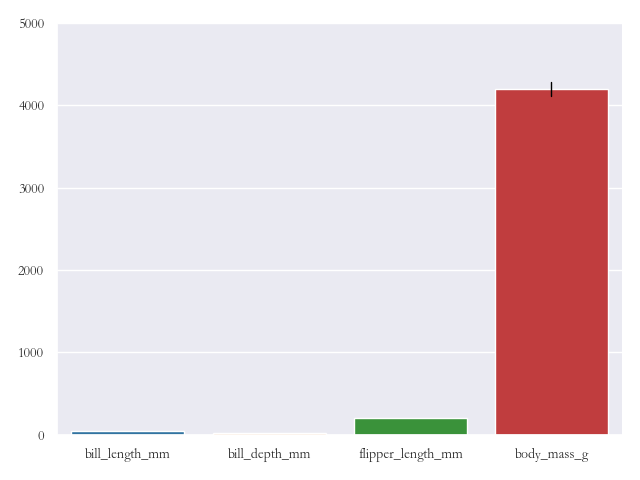

## 测试df参数(某列的柱状图)
```python
>>> ax = bar(penguins["body_mass_g"], savefilename="./image/bar2.png", block=False)
>>> plt.pause(2)
>>> plt.close()
```


## 测试xvarname参数(给定x轴数值变量，单个变量绘制水平柱状图)
```python
>>> ax = bar(penguins, xvarname="body_mass_g", savefilename="./image/bar3.png", block=False)
>>> plt.pause(2)
>>> plt.close()
```


## 测试yvarname参数(给定y轴数值变量，单个变量绘制竖直柱状图)
```python
>>> ax = bar(penguins, yvarname="body_mass_g", savefilename="./image/bar4.png", block=False)
>>> plt.pause(2)
>>> plt.close()
```


## 测试xvarname和yvarname参数(给定xy轴变量，一个字符一个数值，竖直分组柱状误差图)
```python
>>> ax = bar(penguins, xvarname="island", yvarname="body_mass_g", savefilename="./image/bar5.png", block=False)
>>> plt.pause(2)
>>> plt.close()
```


## 测试xvarname和yvarname参数(给定xy轴变量，一个字符一个数值，水平分组柱状误差图)
```python
>>> ax = bar(penguins, yvarname="island", xvarname="body_mass_g", savefilename="./image/bar6.png", block=False)
>>> plt.pause(2)
>>> plt.close()
```


## 测试xvarname和yvarname参数(给定xy轴变量，两个数值，柱状图)
```python
>>> newpenguins = penguins.copy()
>>> newpenguins["index"] = range(1, newpenguins.shape[0]+1)
>>> ax = bar(newpenguins, xvarname="index", yvarname="body_mass_g", savefilename="./image/bar7.png", block=False)
>>> plt.pause(2)
>>> plt.close()
```


## 测试groupby参数(给定XY变量下分组柱状图，颜色区分)
```python
>>> ax = bar(penguins, yvarname="island", xvarname="body_mass_g", groupby="island", savefilename="./image/bar8.png", block=False)
>>> plt.pause(2)
>>> plt.close()
```


## 测试groupby参数(给定XY变量下分组柱状图，类别区分)
```python
>>> ax = bar(penguins, yvarname="island", xvarname="body_mass_g", groupby="sex", savefilename="./image/bar9.png", block=False)
>>> plt.pause(2)
>>> plt.close()
```


## 测试一般绘图的标签参数
```python
>>> ax = bar(flights, xvarname="year", yvarname="passengers", xlabel="年份", ylabel="乘客", title="柱状图", xlabelsize=10, ylabelsize=16, titlesize=14, xticklabelsize=9, yticklabelsize=15, xticklabelrotation=30, yticklabelrotation=45, savefilename="./image/bar10.png", block=False)
>>> plt.pause(2)
>>> plt.close()
```


## 测试colormap参数(分组柱状图指定颜色映射)
```python
>>> ax = bar(penguins, xvarname="island", yvarname="body_mass_g", groupby="sex", colormap="Set3", savefilename="./image/bar11.png", block=False)
>>> plt.pause(2)
>>> plt.close()
```


## 测试colormap参数(分组柱状图指定颜色名称)
```python
>>> ax = bar(penguins, xvarname="island", yvarname="body_mass_g", groupby="sex", colormap=["red", "green"], savefilename="./image/bar12.png", block=False)
>>> plt.pause(2)
>>> plt.close()
```


## 测试fig_length和fig_width参数(图形大小)
```python
>>> ax = bar(penguins, xvarname="island", yvarname="body_mass_g", groupby="sex", colormap="Set2", fig_length=6, fig_width=8, savefilename="./image/bar13.png", block=False)
>>> plt.pause(2)
>>> plt.close()
```


## 测试layout参数(画布布局)
```python
>>> ax = bar(penguins, xvarname="island", yvarname="body_mass_g", groupby="sex", colormap="Set2", layout="tight", savefilename="./image/bar14.png", block=False)
>>> plt.pause(2)
>>> plt.close()
```


```python
>>> ax = bar(penguins, xvarname="island", yvarname="body_mass_g", groupby="sex", colormap="Set2", layout="constrained", savefilename="./image/bar15.png", block=False)
>>> plt.pause(2)
>>> plt.close()
```


```python
>>> ax = bar(penguins, xvarname="island", yvarname="body_mass_g", groupby="sex", colormap="Set2", layout="compressed", savefilename="./image/bar16.png", block=False)
>>> plt.pause(2)
>>> plt.close()
```


```python
>>> ax = bar(penguins, xvarname="island", yvarname="body_mass_g", groupby="sex", colormap="Set2", layout=None, savefilename="./image/bar17.png", block=False)
>>> plt.pause(2)
>>> plt.close()
```


## 测试hue_order参数(分组变量中的顺序)
```python
>>> ax = bar(penguins, xvarname="island", yvarname="body_mass_g", groupby="sex", colormap="Set2", hue_order=["Male", "Female"], savefilename="./image/bar18.png", block=False)
>>> plt.pause(2)
>>> plt.close()
```


```python
>>> ax = bar(penguins, xvarname="island", yvarname="body_mass_g", groupby="sex", colormap="Set2", hue_order=["Female", "Male"], savefilename="./image/bar19.png", block=False)
>>> plt.pause(2)
>>> plt.close()
```


## 测试order参数(柱子在X轴或者Y轴的排列顺序)
```python
>>> ax = bar(penguins, xvarname="island", yvarname="body_mass_g", groupby="sex", colormap="Set2", order=["Torgersen", "Biscoe", "Dream"], savefilename="./image/bar20.png", block=False)
>>> plt.pause(2)
>>> plt.close()
```


```python
>>> ax = bar(penguins, xvarname="island", yvarname="body_mass_g", groupby="sex", colormap="Set2", order=["Biscoe", "Torgersen", "Dream"], savefilename="./image/bar21.png", block=False)
>>> plt.pause(2)
>>> plt.close()
```


```python
>>> ax = bar(penguins, xvarname="island", yvarname="body_mass_g", groupby="sex", colormap="Set2", order=["Biscoe", "Dream", "Torgersen"], savefilename="./image/bar22.png", block=False)
>>> plt.pause(2)
>>> plt.close()
```


## 测试fontfamily参数(指定字体样式)
```python
>>> ax = bar(flights, xvarname="year", yvarname="passengers", xlabel="年份", ylabel="乘客", title="柱状图", xlabelsize=10, ylabelsize=16, titlesize=14, xticklabelsize=9, yticklabelsize=15, xticklabelrotation=30, yticklabelrotation=45, fontfamily="方正舒体", savefilename="./image/bar23.png", block=False)
>>> plt.pause(2)
>>> plt.close()
```


```python
>>> ax = bar(flights, xvarname="year", yvarname="passengers", xlabel="年份", ylabel="乘客", title="柱状图", xlabelsize=10, ylabelsize=16, titlesize=14, xticklabelsize=9, yticklabelsize=15, xticklabelrotation=30, yticklabelrotation=45, fontfamily="方正姚体", savefilename="./image/bar24.png", block=False)
>>> plt.pause(2)
>>> plt.close()
```


```python
>>> ax = bar(flights, xvarname="year", yvarname="passengers", xlabel="年份", ylabel="乘客", title="柱状图", xlabelsize=10, ylabelsize=16, titlesize=14, xticklabelsize=9, yticklabelsize=15, xticklabelrotation=30, yticklabelrotation=45, fontfamily="仿宋", savefilename="./image/bar25.png", block=False)
>>> plt.pause(2)
>>> plt.close()
```


```python
>>> ax = bar(flights, xvarname="year", yvarname="passengers", xlabel="年份", ylabel="乘客", title="柱状图", xlabelsize=10, ylabelsize=16, titlesize=14, xticklabelsize=9, yticklabelsize=15, xticklabelrotation=30, yticklabelrotation=45, fontfamily="黑体", savefilename="./image/bar26.png", block=False)
>>> plt.pause(2)
>>> plt.close()
```


```python
>>> ax = bar(flights, xvarname="year", yvarname="passengers", xlabel="年份", ylabel="乘客", title="柱状图", xlabelsize=10, ylabelsize=16, titlesize=14, xticklabelsize=9, yticklabelsize=15, xticklabelrotation=30, yticklabelrotation=45, fontfamily="华文彩云", savefilename="./image/bar27.png", block=False)
>>> plt.pause(2)
>>> plt.close()
```

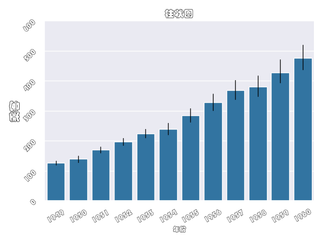

```python
>>> ax = bar(flights, xvarname="year", yvarname="passengers", xlabel="年份", ylabel="乘客", title="柱状图", xlabelsize=10, ylabelsize=16, titlesize=14, xticklabelsize=9, yticklabelsize=15, xticklabelrotation=30, yticklabelrotation=45, fontfamily="华文仿宋", savefilename="./image/bar28.png", block=False)
>>> plt.pause(2)
>>> plt.close()
```


```python
>>> ax = bar(flights, xvarname="year", yvarname="passengers", xlabel="年份", ylabel="乘客", title="柱状图", xlabelsize=10, ylabelsize=16, titlesize=14, xticklabelsize=9, yticklabelsize=15, xticklabelrotation=30, yticklabelrotation=45, fontfamily="华文琥珀", savefilename="./image/bar29.png", block=False)
>>> plt.pause(2)
>>> plt.close()
```


```python
>>> ax = bar(flights, xvarname="year", yvarname="passengers", xlabel="年份", ylabel="乘客", title="柱状图", xlabelsize=10, ylabelsize=16, titlesize=14, xticklabelsize=9, yticklabelsize=15, xticklabelrotation=30, yticklabelrotation=45, fontfamily="华文楷体", savefilename="./image/bar30.png", block=False)
>>> plt.pause(2)
>>> plt.close()
```


```python
>>> ax = bar(flights, xvarname="year", yvarname="passengers", xlabel="年份", ylabel="乘客", title="柱状图", xlabelsize=10, ylabelsize=16, titlesize=14, xticklabelsize=9, yticklabelsize=15, xticklabelrotation=30, yticklabelrotation=45, fontfamily="华文隶书", savefilename="./image/bar31.png", block=False)
>>> plt.pause(2)
>>> plt.close()
```


```python
>>> ax = bar(flights, xvarname="year", yvarname="passengers", xlabel="年份", ylabel="乘客", title="柱状图", xlabelsize=10, ylabelsize=16, titlesize=14, xticklabelsize=9, yticklabelsize=15, xticklabelrotation=30, yticklabelrotation=45, fontfamily="华文宋体", savefilename="./image/bar32.png", block=False)
>>> plt.pause(2)
>>> plt.close()
```


```python
>>> ax = bar(flights, xvarname="year", yvarname="passengers", xlabel="年份", ylabel="乘客", title="柱状图", xlabelsize=10, ylabelsize=16, titlesize=14, xticklabelsize=9, yticklabelsize=15, xticklabelrotation=30, yticklabelrotation=45, fontfamily="华文细黑", savefilename="./image/bar33.png", block=False)
>>> plt.pause(2)
>>> plt.close()
```


```python
>>> ax = bar(flights, xvarname="year", yvarname="passengers", xlabel="年份", ylabel="乘客", title="柱状图", xlabelsize=10, ylabelsize=16, titlesize=14, xticklabelsize=9, yticklabelsize=15, xticklabelrotation=30, yticklabelrotation=45, fontfamily="华文新魏", savefilename="./image/bar34.png", block=False)
>>> plt.pause(2)
>>> plt.close()
```


```python
>>> ax = bar(flights, xvarname="year", yvarname="passengers", xlabel="年份", ylabel="乘客", title="柱状图", xlabelsize=10, ylabelsize=16, titlesize=14, xticklabelsize=9, yticklabelsize=15, xticklabelrotation=30, yticklabelrotation=45, fontfamily="华文行楷", savefilename="./image/bar35.png", block=False)
>>> plt.pause(2)
>>> plt.close()
```


```python
>>> ax = bar(flights, xvarname="year", yvarname="passengers", xlabel="年份", ylabel="乘客", title="柱状图", xlabelsize=10, ylabelsize=16, titlesize=14, xticklabelsize=9, yticklabelsize=15, xticklabelrotation=30, yticklabelrotation=45, fontfamily="华文中宋", savefilename="./image/bar36.png", block=False)
>>> plt.pause(2)
>>> plt.close()
```


```python
>>> ax = bar(flights, xvarname="year", yvarname="passengers", xlabel="年份", ylabel="乘客", title="柱状图", xlabelsize=10, ylabelsize=16, titlesize=14, xticklabelsize=9, yticklabelsize=15, xticklabelrotation=30, yticklabelrotation=45, fontfamily="楷体", savefilename="./image/bar37.png", block=False)
>>> plt.pause(2)
>>> plt.close()
```


```python
>>> ax = bar(flights, xvarname="year", yvarname="passengers", xlabel="年份", ylabel="乘客", title="柱状图", xlabelsize=10, ylabelsize=16, titlesize=14, xticklabelsize=9, yticklabelsize=15, xticklabelrotation=30, yticklabelrotation=45, fontfamily="隶书", savefilename="./image/bar38.png", block=False)
>>> plt.pause(2)
>>> plt.close()
```


```python
>>> ax = bar(flights, xvarname="year", yvarname="passengers", xlabel="年份", ylabel="乘客", title="柱状图", xlabelsize=10, ylabelsize=16, titlesize=14, xticklabelsize=9, yticklabelsize=15, xticklabelrotation=30, yticklabelrotation=45, fontfamily="宋体", savefilename="./image/bar39.png", block=False)
>>> plt.pause(2)
>>> plt.close()
```


```python
>>> ax = bar(flights, xvarname="year", yvarname="passengers", xlabel="年份", ylabel="乘客", title="柱状图", xlabelsize=10, ylabelsize=16, titlesize=14, xticklabelsize=9, yticklabelsize=15, xticklabelrotation=30, yticklabelrotation=45, fontfamily="新宋体", savefilename="./image/bar40.png", block=False)
>>> plt.pause(2)
>>> plt.close()
```


```python
>>> ax = bar(flights, xvarname="year", yvarname="passengers", xlabel="年份", ylabel="乘客", title="柱状图", xlabelsize=10, ylabelsize=16, titlesize=14, xticklabelsize=9, yticklabelsize=15, xticklabelrotation=30, yticklabelrotation=45, fontfamily="幼圆", savefilename="./image/bar41.png", block=False)
>>> plt.pause(2)
>>> plt.close()
```


```python
>>> ax = bar(flights, xvarname="year", yvarname="passengers", xlabel="year", ylabel="passengers", title="Bar Plot", xlabelsize=10, ylabelsize=16, titlesize=14, xticklabelsize=9, yticklabelsize=15, xticklabelrotation=30, yticklabelrotation=45, fontfamily="TimesNewRoman", savefilename="./image/bar42.png", block=False)
>>> plt.pause(2)
>>> plt.close()
```


```python
>>> ax = bar(flights, xvarname="year", yvarname="passengers", xlabel="year", ylabel="passengers", title="Bar Plot", xlabelsize=10, ylabelsize=16, titlesize=14, xticklabelsize=9, yticklabelsize=15, xticklabelrotation=30, yticklabelrotation=45, fontfamily="Arial", savefilename="./image/bar43.png", block=False)
>>> plt.pause(2)
>>> plt.close()
```


## 测试isshowplot参数(是否显示图形)
```python
>>> ax = bar(flights, xvarname="year", yvarname="passengers", isshowplot=1, savefilename="./image/bar44.png", block=False)
>>> plt.pause(2)
>>> plt.close()
```


```python
>>> ax = bar(flights, xvarname="year", yvarname="passengers", isshowplot=0, savefilename="./image/bar45.png", block=False)
```


## 测试snsstyle参数(使用seaborn的风格)
```python
>>> ax = bar(flights, xvarname="year", yvarname="passengers", snsstyle="darkgrid", savefilename="./image/bar46.png", block=False)
>>> plt.pause(2)
>>> plt.close()
```


```python
>>> ax = bar(flights, xvarname="year", yvarname="passengers", snsstyle="whitegrid", savefilename="./image/bar47.png", block=False)
>>> plt.pause(2)
>>> plt.close()
```


```python
>>> ax = bar(flights, xvarname="year", yvarname="passengers", snsstyle="dark", savefilename="./image/bar48.png", block=False)
>>> plt.pause(2)
>>> plt.close()
```


```python
>>> ax = bar(flights, xvarname="year", yvarname="passengers", snsstyle="white", savefilename="./image/bar49.png", block=False)
>>> plt.pause(2)
>>> plt.close()
```


```python
>>> ax = bar(flights, xvarname="year", yvarname="passengers", snsstyle="ticks", savefilename="./image/bar50.png", block=False)
>>> plt.pause(2)
>>> plt.close()
```


## 测试isremoveleftspine参数(移除左轴线，snsstyle为ticks或者white时才有用)
```python
>>> ax = bar(flights, xvarname="year", yvarname="passengers", snsstyle="white", removeleftspine=1, savefilename="./image/bar51.png", block=False)
>>> plt.pause(2)
>>> plt.close()
```


```python
>>> ax = bar(flights, xvarname="year", yvarname="passengers", snsstyle="ticks", removeleftspine=0, savefilename="./image/bar52.png", block=False)
>>> plt.pause(2)
>>> plt.close()
```


## 测试isremoverightspine参数(移除右轴线，snsstyle为ticks或者white时才有用)
```python
>>> ax = bar(flights, xvarname="year", yvarname="passengers", snsstyle="white", removerightspine=1, savefilename="./image/bar53.png", block=False)
>>> plt.pause(2)
>>> plt.close()
```


```python
>>> ax = bar(flights, xvarname="year", yvarname="passengers", snsstyle="ticks", removerightspine=0, savefilename="./image/bar54.png", block=False)
>>> plt.pause(2)
>>> plt.close()
```

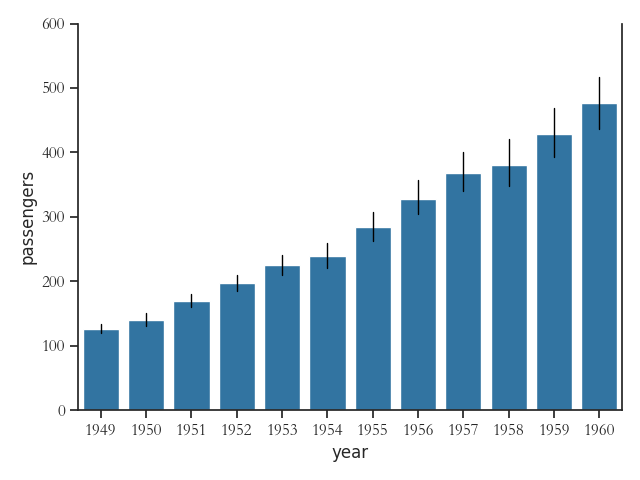

## 测试isremovetopspine参数(移除上轴线，snsstyle为ticks或者white时才有用)
```python
>>> ax = bar(flights, xvarname="year", yvarname="passengers", snsstyle="white", removetopspine=1, savefilename="./image/bar55.png", block=False)
>>> plt.pause(2)
>>> plt.close()
```


```python
>>> ax = bar(flights, xvarname="year", yvarname="passengers", snsstyle="ticks", removetopspine=0, savefilename="./image/bar56.png", block=False)
>>> plt.pause(2)
>>> plt.close()
```


## 测试isremovebottomspine参数(移除下轴线，snsstyle为ticks或者white时才有用)
```python
>>> ax = bar(flights, xvarname="year", yvarname="passengers", snsstyle="white", removebottomspine=1, savefilename="./image/bar57.png", block=False)
>>> plt.pause(2)
>>> plt.close()
```

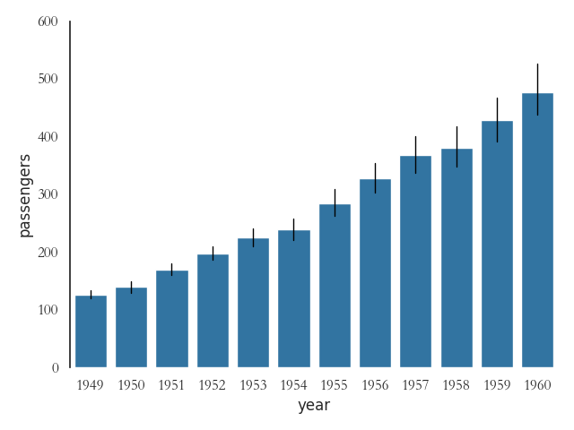

```python
>>> ax = bar(flights, xvarname="year", yvarname="passengers", snsstyle="ticks", removebottomspine=0, savefilename="./image/bar58.png", block=False)
>>> plt.pause(2)
>>> plt.close()
```


## 测试offset参数(图形与轴线距离)
```python
>>> ax = bar(flights, xvarname="year", yvarname="passengers", snsstyle="ticks", offset=3, savefilename="./image/bar59.png", block=False)
>>> plt.pause(2)
>>> plt.close()
```

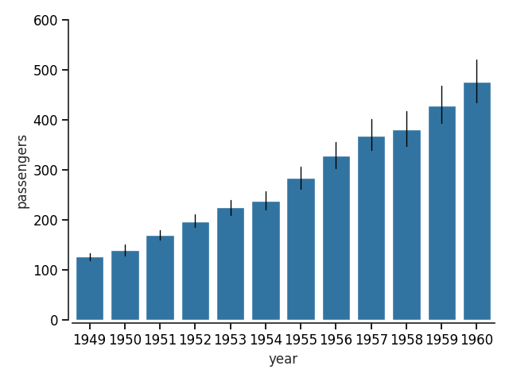

```python
>>> ax = bar(flights, xvarname="year", yvarname="passengers", offset=3, savefilename="./image/bar60.png", block=False)
>>> plt.pause(2)
>>> plt.close()
```


## 测试trim参数(设置R风格轴线)
```python
>>> ax = bar(flights, xvarname="year", yvarname="passengers", snsstyle="ticks", trim=1, savefilename="./image/bar61.png", block=False)
>>> plt.pause(2)
>>> plt.close()
```


```python
>>> ax = bar(flights, xvarname="year", yvarname="passengers", trim=1, savefilename="./image/bar62.png", block=False)
>>> plt.pause(2)
>>> plt.close()
```


## 测试contextstyle参数(绘图风格)
```python
>>> ax = bar(flights, xvarname="year", yvarname="passengers", contextstyle="notebook", savefilename="./image/bar63.png", block=False)
>>> plt.pause(2)
>>> plt.close()
```


```python
>>> ax = bar(flights, xvarname="year", yvarname="passengers", contextstyle="paper", savefilename="./image/bar64.png", block=False)
>>> plt.pause(2)
>>> plt.close()
```


```python
>>> ax = bar(flights, xvarname="year", yvarname="passengers", contextstyle="talk", savefilename="./image/bar65.png", block=False)
>>> plt.pause(2)
>>> plt.close()
```


```python
>>> ax = bar(flights, xvarname="year", yvarname="passengers", contextstyle="poster", savefilename="./image/bar66.png", block=False)
>>> plt.pause(2)
>>> plt.close()
```


## 测试matplotlibstyle参数(matplotlib支持的绘图风格)
```python
>>> ax = bar(flights, xvarname="year", yvarname="passengers", barparamsdict={"errorbar": None, "estimator": "sum", "isshowdatalabel": 1}, xlabel="年份", ylabel="乘客", title="柱状图", xlabelsize=10, ylabelsize=16, titlesize=14, xticklabelsize=9, yticklabelsize=15, xticklabelrotation=30, yticklabelrotation=45, fontfamily="幼圆", matplotlibstyle="Solarize_Light2", savefilename="./image/bar67.png", block=False)
>>> plt.pause(2)
>>> plt.close()
```


```python
>>> ax = bar(flights, xvarname="year", yvarname="passengers", barparamsdict={"errorbar": None, "estimator": "sum", "isshowdatalabel": 1}, xlabel="年份", ylabel="乘客", title="柱状图", xlabelsize=10, ylabelsize=16, titlesize=14, xticklabelsize=9, yticklabelsize=15, xticklabelrotation=30, yticklabelrotation=45, fontfamily="幼圆", matplotlibstyle="_classic_test_patch", savefilename="./image/bar68.png", block=False)
>>> plt.pause(2)
>>> plt.close()
```


```python
>>> ax = bar(flights, xvarname="year", yvarname="passengers", barparamsdict={"errorbar": None, "estimator": "sum", "isshowdatalabel": 1}, xlabel="年份", ylabel="乘客", title="柱状图", xlabelsize=10, ylabelsize=16, titlesize=14, xticklabelsize=9, yticklabelsize=15, xticklabelrotation=30, yticklabelrotation=45, fontfamily="幼圆", matplotlibstyle="_mpl-gallery", savefilename="./image/bar69.png", block=False)
>>> plt.pause(2)
>>> plt.close()
```


```python
>>> ax = bar(flights, xvarname="year", yvarname="passengers", barparamsdict={"errorbar": None, "estimator": "sum", "isshowdatalabel": 1}, xlabel="年份", ylabel="乘客", title="柱状图", xlabelsize=10, ylabelsize=16, titlesize=14, xticklabelsize=9, yticklabelsize=15, xticklabelrotation=30, yticklabelrotation=45, fontfamily="幼圆", matplotlibstyle="_mpl-gallery-nogrid", savefilename="./image/bar70.png", block=False)
>>> plt.pause(2)
>>> plt.close()
```


```python
>>> ax = bar(flights, xvarname="year", yvarname="passengers", barparamsdict={"errorbar": None, "estimator": "sum", "isshowdatalabel": 1}, xlabel="年份", ylabel="乘客", title="柱状图", xlabelsize=10, ylabelsize=16, titlesize=14, xticklabelsize=9, yticklabelsize=15, xticklabelrotation=30, yticklabelrotation=45, fontfamily="幼圆", matplotlibstyle="bmh", savefilename="./image/bar71.png", block=False)
>>> plt.pause(2)
>>> plt.close()
```


```python
>>> ax = bar(flights, xvarname="year", yvarname="passengers", barparamsdict={"errorbar": None, "estimator": "sum", "isshowdatalabel": 1}, xlabel="年份", ylabel="乘客", title="柱状图", xlabelsize=10, ylabelsize=16, titlesize=14, xticklabelsize=9, yticklabelsize=15, xticklabelrotation=30, yticklabelrotation=45, fontfamily="幼圆", matplotlibstyle="classic", savefilename="./image/bar72.png", block=False)
>>> plt.pause(2)
>>> plt.close()
```


```python
>>> ax = bar(flights, xvarname="year", yvarname="passengers", barparamsdict={"errorbar": None, "estimator": "sum", "isshowdatalabel": 1}, xlabel="年份", ylabel="乘客", title="柱状图", xlabelsize=10, ylabelsize=16, titlesize=14, xticklabelsize=9, yticklabelsize=15, xticklabelrotation=30, yticklabelrotation=45, fontfamily="幼圆", matplotlibstyle="dark_background", savefilename="./image/bar73.png", block=False)
>>> plt.pause(2)
>>> plt.close()
```


```python
>>> ax = bar(flights, xvarname="year", yvarname="passengers", barparamsdict={"errorbar": None, "estimator": "sum", "isshowdatalabel": 1}, xlabel="年份", ylabel="乘客", title="柱状图", xlabelsize=10, ylabelsize=16, titlesize=14, xticklabelsize=9, yticklabelsize=15, xticklabelrotation=30, yticklabelrotation=45, fontfamily="幼圆", matplotlibstyle="fast", savefilename="./image/bar74.png", block=False)
>>> plt.pause(2)
>>> plt.close()
```


```python
>>> ax = bar(flights, xvarname="year", yvarname="passengers", barparamsdict={"errorbar": None, "estimator": "sum", "isshowdatalabel": 1}, xlabel="年份", ylabel="乘客", title="柱状图", xlabelsize=10, ylabelsize=16, titlesize=14, xticklabelsize=9, yticklabelsize=15, xticklabelrotation=30, yticklabelrotation=45, fontfamily="幼圆", matplotlibstyle="fivethirtyeight", savefilename="./image/bar75.png", block=False)
>>> plt.pause(2)
>>> plt.close()
```


```python
>>> ax = bar(flights, xvarname="year", yvarname="passengers", barparamsdict={"errorbar": None, "estimator": "sum", "isshowdatalabel": 1}, xlabel="年份", ylabel="乘客", title="柱状图", xlabelsize=10, ylabelsize=16, titlesize=14, xticklabelsize=9, yticklabelsize=15, xticklabelrotation=30, yticklabelrotation=45, fontfamily="幼圆", matplotlibstyle="ggplot", savefilename="./image/bar76.png", block=False)
>>> plt.pause(2)
>>> plt.close()
```

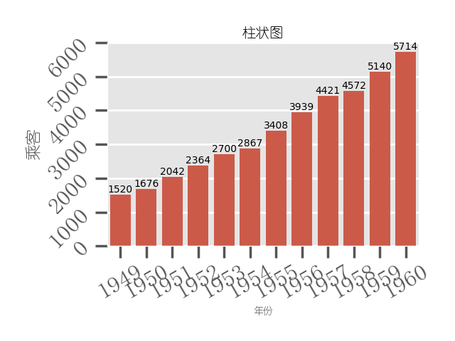

```python
>>> ax = bar(flights, xvarname="year", yvarname="passengers", barparamsdict={"errorbar": None, "estimator": "sum", "isshowdatalabel": 1}, xlabel="年份", ylabel="乘客", title="柱状图", xlabelsize=10, ylabelsize=16, titlesize=14, xticklabelsize=9, yticklabelsize=15, xticklabelrotation=30, yticklabelrotation=45, fontfamily="幼圆", matplotlibstyle="grayscale", savefilename="./image/bar77.png", block=False)
>>> plt.pause(2)
>>> plt.close()
```


```python
>>> ax = bar(flights, xvarname="year", yvarname="passengers", barparamsdict={"errorbar": None, "estimator": "sum", "isshowdatalabel": 1}, xlabel="年份", ylabel="乘客", title="柱状图", xlabelsize=10, ylabelsize=16, titlesize=14, xticklabelsize=9, yticklabelsize=15, xticklabelrotation=30, yticklabelrotation=45, fontfamily="幼圆", matplotlibstyle="seaborn-v0_8", savefilename="./image/bar78.png", block=False)
>>> plt.pause(2)
>>> plt.close()
```


```python
>>> ax = bar(flights, xvarname="year", yvarname="passengers", barparamsdict={"errorbar": None, "estimator": "sum", "isshowdatalabel": 1}, xlabel="年份", ylabel="乘客", title="柱状图", xlabelsize=10, ylabelsize=16, titlesize=14, xticklabelsize=9, yticklabelsize=15, xticklabelrotation=30, yticklabelrotation=45, fontfamily="幼圆", matplotlibstyle="seaborn-v0_8-bright", savefilename="./image/bar79.png", block=False)
>>> plt.pause(2)
>>> plt.close()
```


```python
>>> ax = bar(flights, xvarname="year", yvarname="passengers", barparamsdict={"errorbar": None, "estimator": "sum", "isshowdatalabel": 1}, xlabel="年份", ylabel="乘客", title="柱状图", xlabelsize=10, ylabelsize=16, titlesize=14, xticklabelsize=9, yticklabelsize=15, xticklabelrotation=30, yticklabelrotation=45, fontfamily="幼圆", matplotlibstyle="seaborn-v0_8-colorblind", savefilename="./image/bar80.png", block=False)
>>> plt.pause(2)
>>> plt.close()
```


```python
>>> ax = bar(flights, xvarname="year", yvarname="passengers", barparamsdict={"errorbar": None, "estimator": "sum", "isshowdatalabel": 1}, xlabel="年份", ylabel="乘客", title="柱状图", xlabelsize=10, ylabelsize=16, titlesize=14, xticklabelsize=9, yticklabelsize=15, xticklabelrotation=30, yticklabelrotation=45, fontfamily="幼圆", matplotlibstyle="seaborn-v0_8-dark", savefilename="./image/bar81.png", block=False)
>>> plt.pause(2)
>>> plt.close()
```


```python
>>> ax = bar(flights, xvarname="year", yvarname="passengers", barparamsdict={"errorbar": None, "estimator": "sum", "isshowdatalabel": 1}, xlabel="年份", ylabel="乘客", title="柱状图", xlabelsize=10, ylabelsize=16, titlesize=14, xticklabelsize=9, yticklabelsize=15, xticklabelrotation=30, yticklabelrotation=45, fontfamily="幼圆", matplotlibstyle="seaborn-v0_8-dark-palette", savefilename="./image/bar82.png", block=False)
>>> plt.pause(2)
>>> plt.close()
```


```python
>>> ax = bar(flights, xvarname="year", yvarname="passengers", barparamsdict={"errorbar": None, "estimator": "sum", "isshowdatalabel": 1}, xlabel="年份", ylabel="乘客", title="柱状图", xlabelsize=10, ylabelsize=16, titlesize=14, xticklabelsize=9, yticklabelsize=15, xticklabelrotation=30, yticklabelrotation=45, fontfamily="幼圆", matplotlibstyle="seaborn-v0_8-darkgrid", savefilename="./image/bar83.png", block=False)
>>> plt.pause(2)
>>> plt.close()
```


```python
>>> ax = bar(flights, xvarname="year", yvarname="passengers", barparamsdict={"errorbar": None, "estimator": "sum", "isshowdatalabel": 1}, xlabel="年份", ylabel="乘客", title="柱状图", xlabelsize=10, ylabelsize=16, titlesize=14, xticklabelsize=9, yticklabelsize=15, xticklabelrotation=30, yticklabelrotation=45, fontfamily="幼圆", matplotlibstyle="seaborn-v0_8-deep", savefilename="./image/bar84.png", block=False)
>>> plt.pause(2)
>>> plt.close()
```


```python
>>> ax = bar(flights, xvarname="year", yvarname="passengers", barparamsdict={"errorbar": None, "estimator": "sum", "isshowdatalabel": 1}, xlabel="年份", ylabel="乘客", title="柱状图", xlabelsize=10, ylabelsize=16, titlesize=14, xticklabelsize=9, yticklabelsize=15, xticklabelrotation=30, yticklabelrotation=45, fontfamily="幼圆", matplotlibstyle="seaborn-v0_8-muted", savefilename="./image/bar85.png", block=False)
>>> plt.pause(2)
>>> plt.close()
```


```python
>>> ax = bar(flights, xvarname="year", yvarname="passengers", barparamsdict={"errorbar": None, "estimator": "sum", "isshowdatalabel": 1}, xlabel="年份", ylabel="乘客", title="柱状图", xlabelsize=10, ylabelsize=16, titlesize=14, xticklabelsize=9, yticklabelsize=15, xticklabelrotation=30, yticklabelrotation=45, fontfamily="幼圆", matplotlibstyle="seaborn-v0_8-notebook", savefilename="./image/bar86.png", block=False)
>>> plt.pause(2)
>>> plt.close()
```


```python
>>> ax = bar(flights, xvarname="year", yvarname="passengers", barparamsdict={"errorbar": None, "estimator": "sum", "isshowdatalabel": 1}, xlabel="年份", ylabel="乘客", title="柱状图", xlabelsize=10, ylabelsize=16, titlesize=14, xticklabelsize=9, yticklabelsize=15, xticklabelrotation=30, yticklabelrotation=45, fontfamily="幼圆", matplotlibstyle="seaborn-v0_8-paper", savefilename="./image/bar87.png", block=False)
>>> plt.pause(2)
>>> plt.close()
```


```python
>>> ax = bar(flights, xvarname="year", yvarname="passengers", barparamsdict={"errorbar": None, "estimator": "sum", "isshowdatalabel": 1}, xlabel="年份", ylabel="乘客", title="柱状图", xlabelsize=10, ylabelsize=16, titlesize=14, xticklabelsize=9, yticklabelsize=15, xticklabelrotation=30, yticklabelrotation=45, fontfamily="幼圆", matplotlibstyle="seaborn-v0_8-pastel", savefilename="./image/bar88.png", block=False)
>>> plt.pause(2)
>>> plt.close()
```

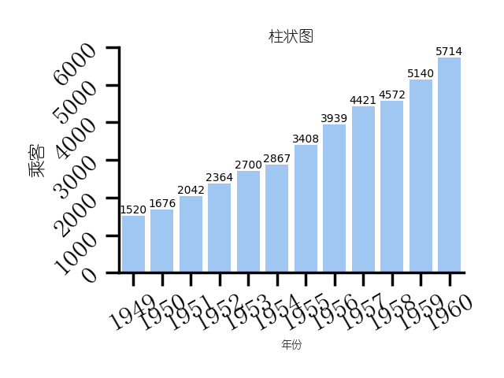

```python
>>> ax = bar(flights, xvarname="year", yvarname="passengers", barparamsdict={"errorbar": None, "estimator": "sum", "isshowdatalabel": 1}, xlabel="年份", ylabel="乘客", title="柱状图", xlabelsize=10, ylabelsize=16, titlesize=14, xticklabelsize=9, yticklabelsize=15, xticklabelrotation=30, yticklabelrotation=45, fontfamily="幼圆", matplotlibstyle="seaborn-v0_8-poster", savefilename="./image/bar89.png", block=False)
>>> plt.pause(2)
>>> plt.close()
```


```python
>>> ax = bar(flights, xvarname="year", yvarname="passengers", barparamsdict={"errorbar": None, "estimator": "sum", "isshowdatalabel": 1}, xlabel="年份", ylabel="乘客", title="柱状图", xlabelsize=10, ylabelsize=16, titlesize=14, xticklabelsize=9, yticklabelsize=15, xticklabelrotation=30, yticklabelrotation=45, fontfamily="幼圆", matplotlibstyle="seaborn-v0_8-talk", savefilename="./image/bar90.png", block=False)
>>> plt.pause(2)
>>> plt.close()
```


```python
>>> ax = bar(flights, xvarname="year", yvarname="passengers", barparamsdict={"errorbar": None, "estimator": "sum", "isshowdatalabel": 1}, xlabel="年份", ylabel="乘客", title="柱状图", xlabelsize=10, ylabelsize=16, titlesize=14, xticklabelsize=9, yticklabelsize=15, xticklabelrotation=30, yticklabelrotation=45, fontfamily="幼圆", matplotlibstyle="seaborn-v0_8-ticks", savefilename="./image/bar91.png", block=False)
>>> plt.pause(2)
>>> plt.close()
```


```python
>>> ax = bar(flights, xvarname="year", yvarname="passengers", barparamsdict={"errorbar": None, "estimator": "sum", "isshowdatalabel": 1}, xlabel="年份", ylabel="乘客", title="柱状图", xlabelsize=10, ylabelsize=16, titlesize=14, xticklabelsize=9, yticklabelsize=15, xticklabelrotation=30, yticklabelrotation=45, fontfamily="幼圆", matplotlibstyle="seaborn-v0_8-white", savefilename="./image/bar92.png", block=False)
>>> plt.pause(2)
>>> plt.close()
```


```python
>>> ax = bar(flights, xvarname="year", yvarname="passengers", barparamsdict={"errorbar": None, "estimator": "sum", "isshowdatalabel": 1}, xlabel="年份", ylabel="乘客", title="柱状图", xlabelsize=10, ylabelsize=16, titlesize=14, xticklabelsize=9, yticklabelsize=15, xticklabelrotation=30, yticklabelrotation=45, fontfamily="幼圆", matplotlibstyle="seaborn-v0_8-whitegrid", savefilename="./image/bar93.png", block=False)
>>> plt.pause(2)
>>> plt.close()
```


```python
>>> ax = bar(flights, xvarname="year", yvarname="passengers", barparamsdict={"errorbar": None, "estimator": "sum", "isshowdatalabel": 1}, xlabel="年份", ylabel="乘客", title="柱状图", xlabelsize=10, ylabelsize=16, titlesize=14, xticklabelsize=9, yticklabelsize=15, xticklabelrotation=30, yticklabelrotation=45, fontfamily="幼圆", matplotlibstyle="tableau-colorblind10", savefilename="./image/bar94.png", block=False)
>>> plt.pause(2)
>>> plt.close()
```


## 测试barparamsdict参数中estimator参数(估计量)
```python
>>> ax = bar(flights, xvarname="year", yvarname="passengers", barparamsdict={"errorbar": None, "estimator": "median"}, savefilename="./image/bar95.png", block=False)
>>> plt.pause(2)
>>> plt.close()
```


```python
>>> ax = bar(flights, xvarname="year", yvarname="passengers", barparamsdict={"errorbar": None, "estimator": "mean"}, savefilename="./image/bar96.png", block=False)
>>> plt.pause(2)
>>> plt.close()
```


```python
>>> ax = bar(flights, xvarname="year", yvarname="passengers", barparamsdict={"errorbar": None, "estimator": "max"}, savefilename="./image/bar97.png", block=False)
>>> plt.pause(2)
>>> plt.close()
```

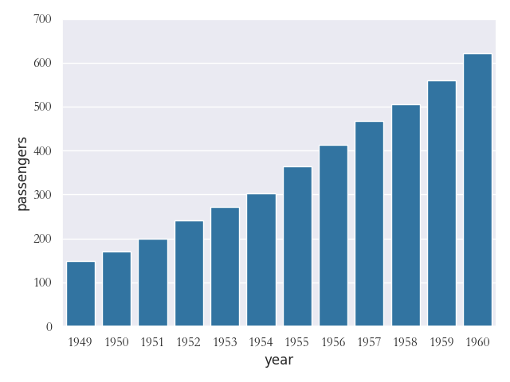

```python
>>> ax = bar(flights, xvarname="year", yvarname="passengers", barparamsdict={"errorbar": None, "estimator": "min"}, savefilename="./image/bar98.png", block=False)
>>> plt.pause(2)
>>> plt.close()
```


```python
>>> ax = bar(flights, xvarname="year", yvarname="passengers", barparamsdict={"errorbar": None, "estimator": "var"}, savefilename="./image/bar99.png", block=False)
>>> plt.pause(2)
>>> plt.close()
```

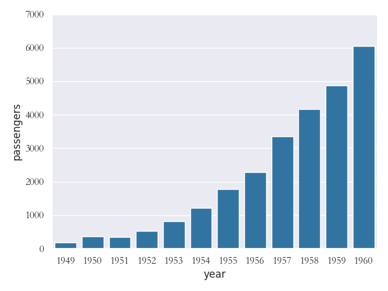

```python
>>> ax = bar(flights, xvarname="year", yvarname="passengers", barparamsdict={"errorbar": None, "estimator": "std"}, savefilename="./image/bar100.png", block=False)
>>> plt.pause(2)
>>> plt.close()
```


```python
>>> r = lambda x: x.max()-x.min()
>>> ax = bar(flights, xvarname="year", yvarname="passengers", barparamsdict={"errorbar": None, "estimator": r}, savefilename="./image/bar101.png", block=False)
>>> plt.pause(2)
>>> plt.close()
```


## 测试barparamdict参数中的errorbar参数(指定误差)
```python
>>> ax = bar(penguins, yvarname="island", xvarname="body_mass_g", barparamsdict={"errorbar": "sd"}, savefilename="./image/bar102.png", block=False)
>>> plt.pause(2)
>>> plt.close()
```


```python
>>> ax = bar(penguins, yvarname="island", xvarname="body_mass_g", barparamsdict={"errorbar": "ci"}, savefilename="./image/bar103.png", block=False)
>>> plt.pause(2)
>>> plt.close()
```


```python
>>> ax = bar(penguins, yvarname="island", xvarname="body_mass_g", barparamsdict={"errorbar": "se"}, savefilename="./image/bar104.png", block=False)
>>> plt.pause(2)
>>> plt.close()
```


```python
>>> ax = bar(penguins, yvarname="island", xvarname="body_mass_g", barparamsdict={"errorbar": "pi"}, savefilename="./image/bar105.png", block=False)
>>> plt.pause(2)
>>> plt.close()
```


## 测试barparamdict参数中的errorbar参数(不显示误差)
```python
>>> ax = bar(flights, xvarname="year", yvarname="passengers", barparamsdict={"errorbar": None, "estimator": "sum"}, savefilename="./image/bar106.png", block=False)
>>> plt.pause(2)
>>> plt.close()
```

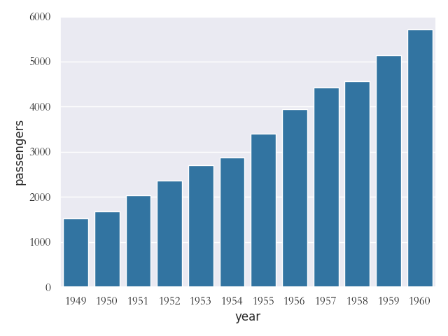

## 测试barparamdict参数中的n_boot参数(bootstrap方法估计置信区间的重抽样次数)
```python
>>> ax = bar(penguins, yvarname="island", xvarname="body_mass_g", barparamsdict={"errorbar": "ci", "n_boot": 2000}, savefilename="./image/bar107.png", block=False)
>>> plt.pause(2)
>>> plt.close()
```


## 测试barparamdict参数中的seed参数(bootstrap方法估计置信区间的随机种子数)
```python
>>> ax = bar(penguins, yvarname="island", xvarname="body_mass_g", barparamsdict={"errorbar": "ci", "seed": 2}, savefilename="./image/bar108.png", block=False)
>>> plt.pause(2)
>>> plt.close()
```


## 测试barparamdict参数中的orient参数(当xy都是数值变量时存在歧义，显示指定水平柱状误差图)
```python
>>> ax = bar(flights, xvarname="passengers", yvarname="year", barparamsdict={"orient": "h"}, savefilename="./image/bar109.png", block=False)
>>> plt.pause(2)
>>> plt.close()
```


```python
>>> ax = bar(flights, xvarname="year", yvarname="passengers", barparamsdict={"orient": "v"}, savefilename="./image/bar110.png", block=False)
>>> plt.pause(2)
>>> plt.close()
```


## 测试barparamdict参数中的color参数(填充颜色)
```python
>>> ax = bar(flights, xvarname="year", yvarname="passengers", barparamsdict={"color": "red"}, savefilename="./image/bar111.png", block=False)
>>> plt.pause(2)
>>> plt.close()
```


```python
>>> ax = bar(penguins, xvarname="island", yvarname="body_mass_g", groupby="island", barparamsdict={"color": "green"}, savefilename="./image/bar112.png", block=False)
>>> plt.pause(2)
>>> plt.close()
```

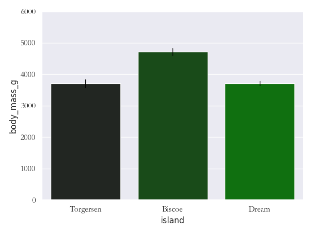

```python
>>> ax = bar(penguins, xvarname="island", yvarname="body_mass_g", groupby="sex", barparamsdict={"color": "blue"}, savefilename="./image/bar113.png", block=False)
>>> plt.pause(2)
>>> plt.close()
```


## 测试barparamdict参数中的color参数(不填充颜色)
```python
>>> ax = bar(flights, xvarname="year", yvarname="passengers", barparamsdict={"isfill": 0}, savefilename="./image/bar114.png", block=False)
>>> plt.pause(2)
>>> plt.close()
```


## 测试barparamdict参数中的saturation参数(颜色饱和度)
```python
>>> ax = bar(flights, xvarname="year", yvarname="passengers", barparamsdict={"color": "red", "saturation": 0.2}, savefilename="./image/bar115.png", block=False)
>>> plt.pause(2)
>>> plt.close()
```


## 测试barparamdict参数中的width参数(设置柱子宽度)
```python
>>> ax = bar(flights, xvarname="year", yvarname="passengers", barparamsdict={"width": 0.4}, savefilename="./image/bar116.png", block=False)
>>> plt.pause(2)
>>> plt.close()
```


```python
>>> ax = bar(flights, xvarname="year", yvarname="passengers", barparamsdict={"width": 1}, savefilename="./image/bar117.png", block=False)
>>> plt.pause(2)
>>> plt.close()
```


## 测试barparamdict参数中的dodge参数(设置分组柱状图的排列方式)
```python
>>> ax = bar(penguins, xvarname="island", yvarname="body_mass_g", groupby="sex", barparamsdict={"dodge": 0}, savefilename="./image/bar118.png", block=False)
>>> plt.pause(2)
>>> plt.close()
```


```python
>>> ax = bar(penguins, xvarname="island", yvarname="body_mass_g", groupby="sex", barparamsdict={"dodge": 1}, savefilename="./image/bar119.png", block=False)
>>> plt.pause(2)
>>> plt.close()
```


## 测试barparamdict参数中的gap参数(设置分组柱子之间的间距)
```python
>>> ax = bar(penguins, xvarname="island", yvarname="body_mass_g", groupby="sex", barparamsdict={"dodge": 1, "gap": 0.3}, savefilename="./image/bar120.png", block=False)
>>> plt.pause(2)
>>> plt.close()
```

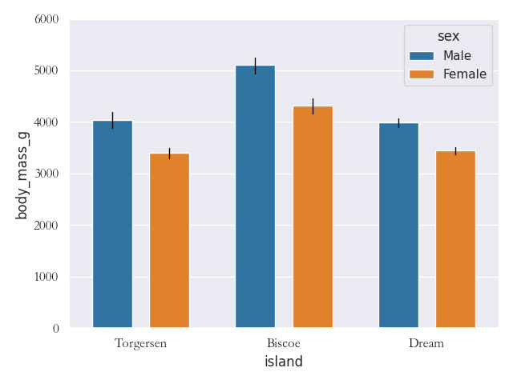

```python
>>> ax = bar(penguins, xvarname="island", yvarname="body_mass_g", groupby="sex", barparamsdict={"dodge": 1, "gap": 0.1}, savefilename="./image/bar121.png", block=False)
>>> plt.pause(2)
>>> plt.close()
```


```python
>>> ax = bar(penguins, xvarname="island", yvarname="body_mass_g", groupby="sex", barparamsdict={"dodge": 0, "gap": 0.3}, savefilename="./image/bar122.png", block=False)
>>> plt.pause(2)
>>> plt.close()
```


## 测试barparamdict参数中的gap参数(数据对数化)
```python
>>> ax = bar(penguins, xvarname="island", yvarname="body_mass_g", groupby="sex", barparamsdict={"islog": 0}, savefilename="./image/bar123.png", block=False)
>>> plt.pause(2)
>>> plt.close()
```


```python
>>> ax = bar(penguins, xvarname="island", yvarname="body_mass_g", groupby="sex", barparamsdict={"islog": 1}, savefilename="./image/bar124.png", block=False)
>>> plt.pause(2)
>>> plt.close()
```

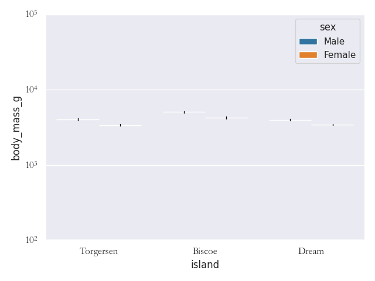

```python
>>> ax = bar(penguins, xvarname="island", yvarname="body_mass_g", groupby="sex", barparamsdict={"islog": np.exp(1)}, savefilename="./image/bar125.png", block=False)
>>> plt.pause(2)
>>> plt.close()
```


## 测试barparamdict参数中的legend参数(指定图例样式)
```python
>>> ax = bar(penguins, xvarname="island", yvarname="body_mass_g", groupby="sex", barparamsdict={"legend": "auto"}, savefilename="./image/bar126.png", block=False)
>>> plt.pause(2)
>>> plt.close()
```


```python
>>> ax = bar(penguins, xvarname="island", yvarname="body_mass_g", groupby="sex", barparamsdict={"legend": "brief"}, savefilename="./image/bar127.png", block=False)
>>> plt.pause(2)
>>> plt.close()
```


```python
>>> ax = bar(penguins, xvarname="island", yvarname="body_mass_g", groupby="sex", barparamsdict={"legend": "full"}, savefilename="./image/bar128.png", block=False)
>>> plt.pause(2)
>>> plt.close()
```


```python
>>> ax = bar(penguins, xvarname="island", yvarname="body_mass_g", groupby="sex", barparamsdict={"legend": False}, savefilename="./image/bar129.png", block=False)
>>> plt.pause(2)
>>> plt.close()
```


## 测试barparamdict参数中的capsize参数(误差条上短横线相对于柱子的宽度)
```python
>>> ax = bar(penguins, xvarname="island", yvarname="body_mass_g", groupby="sex", barparamsdict={"capsize": 0.3}, savefilename="./image/bar130.png", block=False)
>>> plt.pause(2)
>>> plt.close()
```


```python
>>> ax = bar(penguins, xvarname="island", yvarname="body_mass_g", groupby="sex", barparamsdict={"capsize": 0.8}, savefilename="./image/bar131.png", block=False)
>>> plt.pause(2)
>>> plt.close()
```


## 测试barparamdict参数中的isshowdatalabel参数(显示数据标签)
```python
>>> ax = bar(penguins, xvarname="island", yvarname="body_mass_g", groupby="sex", barparamsdict={"isshowdatalabel": 1}, savefilename="./image/bar132.png", block=False)
>>> plt.pause(2)
>>> plt.close()
```


## 测试barparamdict参数中的datalabelsize,datalabelcolor,datalabelformat参数(数据标签格式)
```python
>>> ax = bar(penguins, xvarname="island", yvarname="body_mass_g", groupby="sex", barparamsdict={"isshowdatalabel": 1, "datalabelsize": 8, "datalabelformat": "{:.1f}", "datalabelcolor": "purple"}, savefilename="./image/bar133.png", block=False)
>>> plt.pause(2)
>>> plt.close()
```


## 测试barparamdict参数中的errorbar_linewidth,errorbar_linecolor,errorbar_linestyle参数(errorbar样式)
```python
>>> ax = bar(penguins, xvarname="island", yvarname="body_mass_g", groupby="sex", barparamsdict={"errorbar_linestyle": "-.", "errorbar_linecolor": "purple", "errorbar_linewidth": 0.5}, savefilename="./image/bar134.png", block=False)
>>> plt.pause(2)
>>> plt.close()
```


