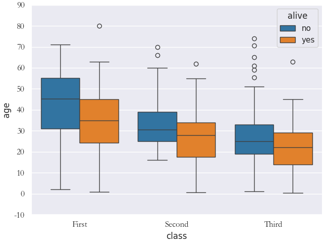
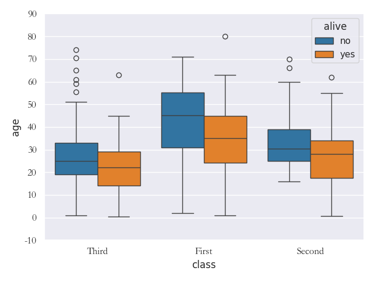
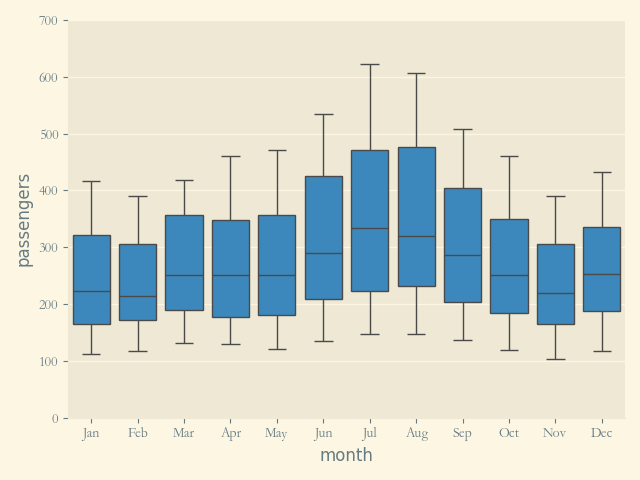

# 导入模块
```python
>>> import sys
>>> sys.path.append(r"D:\document\statistics\TidyStatsProject")
>>> from EasySeaborn import box
>>> import matplotlib.pyplot as plt
>>> from SoEasyData import GetSeabornData
>>> import numpy as np
>>> titanic = GetSeabornData("titanic")
>>> flights = GetSeabornData("flights")
```

## 测试df参数(绘制整个dataframe中数值变量的估计量和误差值)
```python
>>> ax = box(titanic, savefilename="./image/box1.png",block=False)
>>> plt.pause(2)
>>> plt.close()
```


## 测试df参数(某列箱线图)
```python
>>> ax = box(titanic["age"], savefilename="./image/box2.png", block=False)
>>> plt.pause(2)
>>> plt.close()
```


## 测试xvarname参数(给定x轴数值变量，单个变量绘制水平箱线图)
```python
>>> ax = box(titanic, xvarname="age", savefilename="./image/box3.png", block=False)
>>> plt.pause(2)
>>> plt.close()
```


## 测试yvarname参数(给定y轴数值变量，单个变量绘制竖直箱线图)
```python
>>> ax = box(titanic, yvarname="age", savefilename="./image/box4.png", block=False)
>>> plt.pause(2)
>>> plt.close()
```


## 测试xvarname和yvarname参数(给定xy轴变量，一个字符一个数值，竖直分组箱线图)
```python
>>> ax = box(titanic, xvarname="sex", yvarname="age", savefilename="./image/box5.png", block=False)
>>> plt.pause(2)
>>> plt.close()
```


## 测试xvarname和yvarname参数(给定xy轴变量，两个数值，竖直分组箱线图)
```python
>>> ax = box(titanic, xvarname="survived", yvarname="age", savefilename="./image/box6.png", block=False)
>>> plt.pause(2)
>>> plt.close()
```


## 测试groupby参数(给定XY变量下分组箱线图，颜色区分)
```python
>>> ax = box(titanic, xvarname="class", yvarname="age", groupby="class", savefilename="./image/box7.png", block=False)
>>> plt.pause(2)
>>> plt.close()
```


## 测试groupby参数(给定XY变量下分组箱线图，类别区分)
```python
>>> ax = box(titanic, xvarname="class", yvarname="age", groupby="alive", 
savefilename="./image/box8.png", block=False)
>>> plt.pause(2)
>>> plt.close()
```


## 测试一般绘图的标签参数
```python
>>> ax = box(titanic, xvarname="class", yvarname="age", groupby="alive", xlabel="X轴", ylabel="Y轴", title="标题", xlabelsize=10, ylabelsize=16, titlesize=14, xticklabelsize=9, yticklabelsize=15, xticklabelrotation=30, yticklabelrotation=45, savefilename="./image/box9.png", block=False)
>>> plt.pause(2)
>>> plt.close()
```


## 测试colormap参数(分组箱线图指定颜色映射)
```python
>>> ax = box(titanic, xvarname="class", yvarname="age", groupby="alive", colormap="Set2", savefilename="./image/box10.png", block=False)
>>> plt.pause(2)
>>> plt.close()
```


## 测试colormap参数(分组箱线图指定颜色名称)
```python
>>> ax = box(titanic, xvarname="class", yvarname="age", groupby="alive", colormap=["red", "green"], savefilename="./image/box11.png", block=False)
>>> plt.pause(2)
>>> plt.close()
```


## 测试fig_length和fig_width参数(图形大小)
```python
>>> ax = box(titanic, xvarname="class", yvarname="age", groupby="alive", fig_length=6, fig_width=8, savefilename="./image/box12.png", block=False)
>>> plt.pause(2)
>>> plt.close()
```


## 测试layout参数(画布布局)
```python
>>> ax = box(titanic, xvarname="class", yvarname="age", groupby="alive", layout="constrained", savefilename="./image/box13.png", block=False)
>>> plt.pause(2)
>>> plt.close()
```


```python
>>> ax = box(titanic, xvarname="class", yvarname="age", groupby="alive", layout="compressed", savefilename="./image/box14.png", block=False)
>>> plt.pause(2)
>>> plt.close()
```



```python
>>> ax = box(titanic, xvarname="class", yvarname="age", groupby="alive", layout="tight", savefilename="./image/box15.png", block=False)
>>> plt.pause(2)
>>> plt.close()
```


```python
>>> ax = box(titanic, xvarname="class", yvarname="age", groupby="alive", layout=None, savefilename="./image/box16.png", block=False)
>>> plt.pause(2)
>>> plt.close()
```


## 测试hue_order参数(分组变量中的顺序)
```python
>>> ax = box(titanic, xvarname="class", yvarname="age", groupby="alive", hue_order=["no", "yes"], savefilename="./image/box17.png", block=False)
>>> plt.pause(2)
>>> plt.close()
```


```python
>>> ax = box(titanic, xvarname="class", yvarname="age", groupby="alive", hue_order=["yes", "no"], savefilename="./image/box18.png", block=False)
>>> plt.pause(2)
>>> plt.close()
```


## 测试order参数(箱子在X轴或者Y轴的排列顺序)
```python
>>> ax = box(titanic, xvarname="class", yvarname="age", groupby="alive", order=["First", "Third", "Second"], savefilename="./image/box19.png", block=False)
>>> plt.pause(2)
>>> plt.close()
```


```python
>>> ax = box(titanic, xvarname="class", yvarname="age", groupby="alive", order=["Third", "First", "Second"], savefilename="./image/box20.png", block=False)
>>> plt.pause(2)
>>> plt.close()
```



```python
>>> ax = box(titanic, xvarname="class", yvarname="age", groupby="alive", order=["Third", "Second", "First"], savefilename="./image/box21.png", block=False)
>>> plt.pause(2)
>>> plt.close()
```


## 测试fontfamily参数(指定字体样式)
```python
>>> ax = box(titanic, xvarname="class", yvarname="age", xlabel="X轴", ylabel="Y轴", title="箱线图", xlabelsize=10, ylabelsize=16, titlesize=14, xticklabelsize=9, yticklabelsize=15, xticklabelrotation=30, yticklabelrotation=45, fontfamily="方正舒体", savefilename="./image/box22.png", block=False)
>>> plt.pause(2)
>>> plt.close()
```


```python
>>> ax = box(titanic, xvarname="class", yvarname="age", xlabel="X轴", ylabel="Y轴", title="箱线图", xlabelsize=10, ylabelsize=16, titlesize=14, xticklabelsize=9, yticklabelsize=15, xticklabelrotation=30, yticklabelrotation=45, fontfamily="方正姚体", savefilename="./image/box23.png", block=False)
>>> plt.pause(2)
>>> plt.close()
```


```python
>>> ax = box(titanic, xvarname="class", yvarname="age", xlabel="X轴", ylabel="Y轴", title="箱线图", xlabelsize=10, ylabelsize=16, titlesize=14, xticklabelsize=9, yticklabelsize=15, xticklabelrotation=30, yticklabelrotation=45, fontfamily="仿宋", savefilename="./image/box24.png", block=False)
>>> plt.pause(2)
>>> plt.close()
```


```python
>>> ax = box(titanic, xvarname="class", yvarname="age", xlabel="X轴", ylabel="Y轴", title="箱线图", xlabelsize=10, ylabelsize=16, titlesize=14, xticklabelsize=9, yticklabelsize=15, xticklabelrotation=30, yticklabelrotation=45, fontfamily="黑体", savefilename="./image/box25.png", block=False)
>>> plt.pause(2)
>>> plt.close()
```


```python
>>> ax = box(titanic, xvarname="class", yvarname="age", xlabel="X轴", ylabel="Y轴", title="箱线图", xlabelsize=10, ylabelsize=16, titlesize=14, xticklabelsize=9, yticklabelsize=15, xticklabelrotation=30, yticklabelrotation=45, fontfamily="华文彩云", savefilename="./image/box26.png", block=False)
>>> plt.pause(2)
>>> plt.close()
```


```python
>>> ax = box(titanic, xvarname="class", yvarname="age", xlabel="X轴", ylabel="Y轴", title="箱线图", xlabelsize=10, ylabelsize=16, titlesize=14, xticklabelsize=9, yticklabelsize=15, xticklabelrotation=30, yticklabelrotation=45, fontfamily="华文仿宋", savefilename="./image/box27.png", block=False)
>>> plt.pause(2)
>>> plt.close()
```


```python
>>> ax = box(titanic, xvarname="class", yvarname="age", xlabel="X轴", ylabel="Y轴", title="箱线图", xlabelsize=10, ylabelsize=16, titlesize=14, xticklabelsize=9, yticklabelsize=15, xticklabelrotation=30, yticklabelrotation=45, fontfamily="华文琥珀", savefilename="./image/box28.png", block=False)
>>> plt.pause(2)
>>> plt.close()
```


```python
>>> ax = box(titanic, xvarname="class", yvarname="age", xlabel="X轴", ylabel="Y轴", title="箱线图", xlabelsize=10, ylabelsize=16, titlesize=14, xticklabelsize=9, yticklabelsize=15, xticklabelrotation=30, yticklabelrotation=45, fontfamily="华文楷体", savefilename="./image/box29.png", block=False)
>>> plt.pause(2)
>>> plt.close()
```


```python
>>> ax = box(titanic, xvarname="class", yvarname="age", xlabel="X轴", ylabel="Y轴", title="箱线图", xlabelsize=10, ylabelsize=16, titlesize=14, xticklabelsize=9, yticklabelsize=15, xticklabelrotation=30, yticklabelrotation=45, fontfamily="华文隶书", savefilename="./image/box30.png", block=False)
>>> plt.pause(2)
>>> plt.close()
```


```python
>>> ax = box(titanic, xvarname="class", yvarname="age", xlabel="X轴", ylabel="Y轴", title="箱线图", xlabelsize=10, ylabelsize=16, titlesize=14, xticklabelsize=9, yticklabelsize=15, xticklabelrotation=30, yticklabelrotation=45, fontfamily="华文宋体", savefilename="./image/box31.png", block=False)
>>> plt.pause(2)
>>> plt.close()
```


```python
>>> ax = box(titanic, xvarname="class", yvarname="age", xlabel="X轴", ylabel="Y轴", title="箱线图", xlabelsize=10, ylabelsize=16, titlesize=14, xticklabelsize=9, yticklabelsize=15, xticklabelrotation=30, yticklabelrotation=45, fontfamily="华文细黑", savefilename="./image/box32.png", block=False)
>>> plt.pause(2)
>>> plt.close()
```


```python
>>> ax = box(titanic, xvarname="class", yvarname="age", xlabel="X轴", ylabel="Y轴", title="箱线图", xlabelsize=10, ylabelsize=16, titlesize=14, xticklabelsize=9, yticklabelsize=15, xticklabelrotation=30, yticklabelrotation=45, fontfamily="华文新魏", savefilename="./image/box33.png", block=False)
>>> plt.pause(2)
>>> plt.close()
```


```python
>>> ax = box(titanic, xvarname="class", yvarname="age", xlabel="X轴", ylabel="Y轴", title="箱线图", xlabelsize=10, ylabelsize=16, titlesize=14, xticklabelsize=9, yticklabelsize=15, xticklabelrotation=30, yticklabelrotation=45, fontfamily="华文行楷", savefilename="./image/box34.png", block=False)
>>> plt.pause(2)
>>> plt.close()
```


```python
>>> ax = box(titanic, xvarname="class", yvarname="age", xlabel="X轴", ylabel="Y轴", title="箱线图", xlabelsize=10, ylabelsize=16, titlesize=14, xticklabelsize=9, yticklabelsize=15, xticklabelrotation=30, yticklabelrotation=45, fontfamily="华文中宋", savefilename="./image/box35.png", block=False)
>>> plt.pause(2)
>>> plt.close()
```


```python
>>> ax = box(titanic, xvarname="class", yvarname="age", xlabel="X轴", ylabel="Y轴", title="箱线图", xlabelsize=10, ylabelsize=16, titlesize=14, xticklabelsize=9, yticklabelsize=15, xticklabelrotation=30, yticklabelrotation=45, fontfamily="楷体", savefilename="./image/box36.png", block=False)
>>> plt.pause(2)
>>> plt.close()
```


```python
>>> ax = box(titanic, xvarname="class", yvarname="age", xlabel="X轴", ylabel="Y轴", title="箱线图", xlabelsize=10, ylabelsize=16, titlesize=14, xticklabelsize=9, yticklabelsize=15, xticklabelrotation=30, yticklabelrotation=45, fontfamily="隶书", savefilename="./image/box37.png", block=False)
>>> plt.pause(2)
>>> plt.close()
```


```python
>>> ax = box(titanic, xvarname="class", yvarname="age", xlabel="X轴", ylabel="Y轴", title="箱线图", xlabelsize=10, ylabelsize=16, titlesize=14, xticklabelsize=9, yticklabelsize=15, xticklabelrotation=30, yticklabelrotation=45, fontfamily="宋体", savefilename="./image/box38.png", block=False)
>>> plt.pause(2)
>>> plt.close()
```


```python
>>> ax = box(titanic, xvarname="class", yvarname="age", xlabel="X轴", ylabel="Y轴", title="箱线图", xlabelsize=10, ylabelsize=16, titlesize=14, xticklabelsize=9, yticklabelsize=15, xticklabelrotation=30, yticklabelrotation=45, fontfamily="新宋体", savefilename="./image/box39.png", block=False)
>>> plt.pause(2)
>>> plt.close()
```


```python
>>> ax = box(titanic, xvarname="class", yvarname="age", xlabel="X轴", ylabel="Y轴", title="箱线图", xlabelsize=10, ylabelsize=16, titlesize=14, xticklabelsize=9, yticklabelsize=15, xticklabelrotation=30, yticklabelrotation=45, fontfamily="幼圆", savefilename="./image/box40.png", block=False)
>>> plt.pause(2)
>>> plt.close()
```


```python
>>> ax = box(titanic, xvarname="class", yvarname="age", xlabel="class", ylabel="age", title="box Plot", xlabelsize=10, ylabelsize=16, titlesize=14, xticklabelsize=9, yticklabelsize=15, xticklabelrotation=30, yticklabelrotation=45, fontfamily="TimesNewRoman", savefilename="./image/box41.png", block=False)
>>> plt.pause(2)
>>> plt.close()
```


```python
>>> ax = box(titanic, xvarname="class", yvarname="age", xlabel="class", ylabel="age", title="box Plot", xlabelsize=10, ylabelsize=16, titlesize=14, xticklabelsize=9, yticklabelsize=15, xticklabelrotation=30, yticklabelrotation=45, fontfamily="Arial", savefilename="./image/box42.png", block=False)
>>> plt.pause(2)
>>> plt.close()
```


## 测试isshowplot参数(是否显示图形)
```python
>>> ax = box(titanic, xvarname="class", yvarname="age", isshowplot=1, savefilename="./image/box43.png", block=False)
>>> plt.pause(2)
>>> plt.close()
```


```python
>>> ax = box(titanic, xvarname="class", yvarname="age", isshowplot=0, savefilename="./image/box44.png", block=False)
```


## 测试snsstyle参数(使用seaborn的风格)
```python
>>> ax = box(titanic, xvarname="class", yvarname="age", snsstyle="darkgrid", savefilename="./image/box45.png", block=False)
>>> plt.pause(2)
>>> plt.close()
```


```python
>>> ax = box(titanic, xvarname="class", yvarname="age", snsstyle="whitegrid", savefilename="./image/box46.png", block=False)
>>> plt.pause(2)
>>> plt.close()
```


```python
>>> ax = box(titanic, xvarname="class", yvarname="age", snsstyle="dark", savefilename="./image/box47.png", block=False)
>>> plt.pause(2)
>>> plt.close()
```


```python
>>> ax = box(titanic, xvarname="class", yvarname="age", snsstyle="white", savefilename="./image/box48.png", block=False)
>>> plt.pause(2)
>>> plt.close()
```


```python
>>> ax = box(titanic, xvarname="class", yvarname="age", snsstyle="ticks", savefilename="./image/box49.png", block=False)
>>> plt.pause(2)
>>> plt.close()
```


## 测试isremoveleftspine参数(移除左轴线，snsstyle为ticks或者white时才有用)
```python
>>> ax = box(titanic, xvarname="class", yvarname="age", snsstyle="white", removeleftspine=1, savefilename="./image/box50.png", block=False)
>>> plt.pause(2)
>>> plt.close()
```


```python
>>> ax = box(titanic, xvarname="class", yvarname="age", snsstyle="ticks", removeleftspine=0, savefilename="./image/box51.png", block=False)
>>> plt.pause(2)
>>> plt.close()
```


## 测试isremoverightspine参数(移除右轴线，snsstyle为ticks或者white时才有用)
```python
>>> ax = box(titanic, xvarname="class", yvarname="age", snsstyle="white", removerightspine=1, savefilename="./image/box52.png", block=False)
>>> plt.pause(2)
>>> plt.close()
```


```python
>>> ax = box(titanic, xvarname="class", yvarname="age", snsstyle="ticks", removerightspine=0, savefilename="./image/box53.png", block=False)
>>> plt.pause(2)
>>> plt.close()
```


## 测试isremovetopspine参数(移除上轴线，snsstyle为ticks或者white时才有用)
```python
>>> ax = box(titanic, xvarname="class", yvarname="age", snsstyle="white", removetopspine=1, savefilename="./image/box54.png", block=False)
>>> plt.pause(2)
>>> plt.close()
```


```python
>>> ax = box(titanic, xvarname="class", yvarname="age", snsstyle="ticks", removetopspine=0, savefilename="./image/box55.png", block=False)
>>> plt.pause(2)
>>> plt.close()
```


## 测试isremovebottomspine参数(移除下轴线，snsstyle为ticks或者white时才有用)
```python
>>> ax = box(titanic, xvarname="class", yvarname="age", snsstyle="white", removebottomspine=1, savefilename="./image/box56.png", block=False)
>>> plt.pause(2)
>>> plt.close()
```


```python
>>> ax = box(titanic, xvarname="class", yvarname="age", snsstyle="ticks", removebottomspine=0, savefilename="./image/box57.png", block=False)
>>> plt.pause(2)
>>> plt.close()
```


## 测试offset参数(图形与轴线距离)
```python
>>> ax = box(titanic, xvarname="class", yvarname="age", snsstyle="ticks", 
offset=3, savefilename="./image/box58.png", block=False)
>>> plt.pause(2)
>>> plt.close()
```


```python
>>> ax = box(titanic, xvarname="class", yvarname="age", offset=3, savefilename="./image/box59.png", block=False)
>>> plt.pause(2)
>>> plt.close()
```


## 测试trim参数(设置R风格轴线)
```python
>>> ax = box(titanic, xvarname="class", yvarname="age", snsstyle="ticks", trim=1, savefilename="./image/box60.png", block=False)
>>> plt.pause(2)
>>> plt.close()
```


```python
>>> ax = box(titanic, xvarname="class", yvarname="age", trim=1, savefilename="./image/box61.png", block=False)
>>> plt.pause(2)
>>> plt.close()
```


## 测试contextstyle参数(绘图风格)
```python
>>> ax = box(titanic, xvarname="class", yvarname="age", contextstyle="notebook", savefilename="./image/box62.png", block=False)
>>> plt.pause(2)
>>> plt.close()
```


```python
>>> ax = box(titanic, xvarname="class", yvarname="age", contextstyle="paper", savefilename="./image/box63.png", block=False)
>>> plt.pause(2)
>>> plt.close()
```


```python
>>> ax = box(titanic, xvarname="class", yvarname="age", contextstyle="talk", savefilename="./image/box64.png", block=False)
>>> plt.pause(2)
>>> plt.close()
```


```python
>>> ax = box(titanic, xvarname="class", yvarname="age", contextstyle="poster", savefilename="./image/box65.png", block=False)
>>> plt.pause(2)
>>> plt.close()
```


## 测试matplotlibstyle参数(matplotlib支持的绘图风格)
```python
>>> ax = box(flights, xvarname="month", yvarname="passengers", matplotlibstyle="Solarize_Light2", savefilename="./image/box66.png", block=False)
>>> plt.pause(2)
>>> plt.close()
```



```python
>>> ax = box(flights, xvarname="month", yvarname="passengers", matplotlibstyle="_classic_test_patch", savefilename="./image/box67.png", block=False)
>>> plt.pause(2)
>>> plt.close()
```


```python
>>> ax = box(flights, xvarname="month", yvarname="passengers", matplotlibstyle="_mpl-gallery", savefilename="./image/box68.png", block=False)
>>> plt.pause(2)
>>> plt.close()
```


```python
>>> ax = box(flights, xvarname="month", yvarname="passengers", matplotlibstyle="_mpl-gallery-nogrid", savefilename="./image/box69.png", block=False)
>>> plt.pause(2)
>>> plt.close()
```


```python
>>> ax = box(flights, xvarname="month", yvarname="passengers", matplotlibstyle="bmh", savefilename="./image/box70.png", block=False)
>>> plt.pause(2)
>>> plt.close()
```


```python
>>> ax = box(flights, xvarname="month", yvarname="passengers", matplotlibstyle="classic", savefilename="./image/box71.png", block=False)
>>> plt.pause(2)
>>> plt.close()
```


```python
>>> ax = box(flights, xvarname="month", yvarname="passengers", matplotlibstyle="dark_background", savefilename="./image/box72.png", block=False)
>>> plt.pause(2)
>>> plt.close()
```


```python
>>> ax = box(flights, xvarname="month", yvarname="passengers", matplotlibstyle="fast", savefilename="./image/box73.png", block=False)
>>> plt.pause(2)
>>> plt.close()
```


```python
>>> ax = box(flights, xvarname="month", yvarname="passengers", matplotlibstyle="fivethirtyeight", savefilename="./image/box74.png", block=False)
>>> plt.pause(2)
>>> plt.close()
```


```python
>>> ax = box(flights, xvarname="month", yvarname="passengers", matplotlibstyle="ggplot", savefilename="./image/box75.png", block=False)
>>> plt.pause(2)
>>> plt.close()
```


```python
>>> ax = box(flights, xvarname="month", yvarname="passengers", matplotlibstyle="grayscale", savefilename="./image/box76.png", block=False)
>>> plt.pause(2)
>>> plt.close()
```


```python
>>> ax = box(flights, xvarname="month", yvarname="passengers", matplotlibstyle="seaborn-v0_8", savefilename="./image/box77.png", block=False)
>>> plt.pause(2)
>>> plt.close()
```


```python
>>> ax = box(flights, xvarname="month", yvarname="passengers", matplotlibstyle="seaborn-v0_8-bright", savefilename="./image/box78.png", block=False)
>>> plt.pause(2)
>>> plt.close()
```


```python
>>> ax = box(flights, xvarname="month", yvarname="passengers", matplotlibstyle="seaborn-v0_8-colorblind", savefilename="./image/box79.png", block=False)
>>> plt.pause(2)
>>> plt.close()
```


```python
>>> ax = box(flights, xvarname="month", yvarname="passengers", matplotlibstyle="seaborn-v0_8-dark", savefilename="./image/box80.png", block=False)
>>> plt.pause(2)
>>> plt.close()
```


```python
>>> ax = box(flights, xvarname="month", yvarname="passengers", matplotlibstyle="seaborn-v0_8-dark-palette", savefilename="./image/box81.png", block=False)
>>> plt.pause(2)
>>> plt.close()
```


```python
>>> ax = box(flights, xvarname="month", yvarname="passengers", matplotlibstyle="seaborn-v0_8-darkgrid", savefilename="./image/box82.png", block=False)
>>> plt.pause(2)
>>> plt.close()
```


```python
>>> ax = box(flights, xvarname="month", yvarname="passengers", matplotlibstyle="seaborn-v0_8-deep", savefilename="./image/box83.png", block=False)
>>> plt.pause(2)
>>> plt.close()
```


```python
>>> ax = box(flights, xvarname="month", yvarname="passengers", matplotlibstyle="seaborn-v0_8-muted", savefilename="./image/box84.png", block=False)
>>> plt.pause(2)
>>> plt.close()
```


```python
>>> ax = box(flights, xvarname="month", yvarname="passengers", matplotlibstyle="seaborn-v0_8-notebook", savefilename="./image/box85.png", block=False)
>>> plt.pause(2)
>>> plt.close()
```


```python
>>> ax = box(flights, xvarname="month", yvarname="passengers", matplotlibstyle="seaborn-v0_8-paper", savefilename="./image/box86.png", block=False)
>>> plt.pause(2)
>>> plt.close()
```


```python
>>> ax = box(flights, xvarname="month", yvarname="passengers", matplotlibstyle="seaborn-v0_8-pastel", savefilename="./image/box87.png", block=False)
>>> plt.pause(2)
>>> plt.close()
```


```python
>>> ax = box(flights, xvarname="month", yvarname="passengers", matplotlibstyle="seaborn-v0_8-poster", savefilename="./image/box88.png", block=False)
>>> plt.pause(2)
>>> plt.close()
```


```python
>>> ax = box(flights, xvarname="month", yvarname="passengers", matplotlibstyle="seaborn-v0_8-talk", savefilename="./image/box89.png", block=False)
>>> plt.pause(2)
>>> plt.close()
```


```python
>>> ax = box(flights, xvarname="month", yvarname="passengers", matplotlibstyle="seaborn-v0_8-ticks", savefilename="./image/box90.png", block=False)
>>> plt.pause(2)
>>> plt.close()
```


```python
>>> ax = box(flights, xvarname="month", yvarname="passengers", matplotlibstyle="seaborn-v0_8-white", savefilename="./image/box91.png", block=False)
>>> plt.pause(2)
>>> plt.close()
```


```python
>>> ax = box(flights, xvarname="month", yvarname="passengers", matplotlibstyle="seaborn-v0_8-whitegrid", savefilename="./image/box92.png", block=False)
>>> plt.pause(2)
>>> plt.close()
```


```python
>>> ax = box(flights, xvarname="month", yvarname="passengers", matplotlibstyle="tableau-colorblind10", savefilename="./image/box93.png", block=False)
>>> plt.pause(2)
>>> plt.close()
```


## 测试boxparamsdict参数中orient参数(箱线图朝向)
```python
>>> ax = box(titanic, yvarname="survived", xvarname="age", boxparamsdict={"orient": "h"}, savefilename="./image/box94.png", block=False)
>>> plt.pause(2)
>>> plt.close()
```


## 测试boxparamsdict参数中color参数(箱子颜色)
```python
>>> ax = box(titanic, xvarname="class", yvarname="age", boxparamsdict={"color": "green"}, savefilename="./image/box95.png", block=False)
>>> plt.pause(2)
>>> plt.close()
```


## 测试boxparamsdict参数中isfill参数(不填充颜色)
```python
>>> ax = box(titanic, xvarname="class", yvarname="age", boxparamsdict={"isfill": 0}, savefilename="./image/box96.png", block=False)
>>> plt.pause(2)
>>> plt.close()
```


## 测试boxparamsdict参数中saturation参数(颜色饱和度)
```python
>>> ax = box(titanic, xvarname="class", yvarname="age", boxparamsdict={"saturation": 0.3}, savefilename="./image/box97.png", block=False)
>>> plt.pause(2)
>>> plt.close()
```


## 测试boxparamsdict参数中dodge参数(分组排列方式)
```python
>>> ax = box(titanic, xvarname="class", yvarname="age", groupby="sex", boxparamsdict={"dodge": 1}, savefilename="./image/box98.png", block=False)
>>> plt.pause(2)
>>> plt.close()
```


```python
>>> ax = box(titanic, xvarname="class", yvarname="age", groupby="sex", boxparamsdict={"dodge": 0}, savefilename="./image/box99.png", block=False)
>>> plt.pause(2)
>>> plt.close()
```


## 测试boxparamsdict参数中gap参数(增加分组之间的间距)
```python
>>> ax = box(titanic, xvarname="class", yvarname="age", groupby="alive", boxparamsdict={"gap": 0.2}, savefilename="./image/box100.png", block=False)
>>> plt.pause(2)
>>> plt.close()
```


## 测试boxparamsdict参数中whis参数(异常值范围)
```python
>>> ax = box(titanic, xvarname="deck", yvarname="age", groupby="alive", boxparamsdict={"whis": (0, 100)}, savefilename="./image/box101.png", block=False)
>>> plt.pause(2)
>>> plt.close()
```


```python
>>> ax = box(titanic, xvarname="deck", yvarname="age", groupby="alive", boxparamsdict={"whis": 2}, savefilename="./image/box102.png", block=False)
>>> plt.pause(2)
>>> plt.close()
```


## 测试boxparamsdict参数中width参数(箱子宽度)
```python
>>> ax = box(titanic, xvarname="deck", yvarname="age", groupby="alive", boxparamsdict={"width": 0.4}, savefilename="./image/box103.png", block=False)
>>> plt.pause(2)
>>> plt.close()
```


## 测试boxparamsdict参数中linecolor,linewidth参数(箱子样式)
```python
>>> ax = box(titanic, xvarname="deck", yvarname="age", groupby="alive", boxparamsdict={"color": "0.8", "linecolor": "#137", "linewidth": 0.75}, savefilename="./image/box104.png", block=False)
>>> plt.pause(2)
>>> plt.close()
```


## 测试boxparamsdict参数中fliersize参数(异常值点大小)
```python
>>> ax = box(titanic, xvarname="deck", yvarname="age", groupby="alive", boxparamsdict={"fliersize": 1}, savefilename="./image/box105.png", block=False)
>>> plt.pause(2)
>>> plt.close()
```


## 测试boxparamsdict参数中legend参数(指定图例样式)
```python
>>> ax = box(titanic, xvarname="deck", yvarname="age", groupby="alive", boxparamsdict={"saturation": 0.2, "legend": "auto"}, savefilename="./image/box106.png", block=False)
>>> plt.pause(2)
>>> plt.close()
```


```python
>>> ax = box(titanic, xvarname="deck", yvarname="age", groupby="alive", boxparamsdict={"saturation": 0.4, "legend": "full"}, savefilename="./image/box107.png", block=False)
>>> plt.pause(2)
>>> plt.close()
```


```python
>>> ax = box(titanic, xvarname="deck", yvarname="age", groupby="alive", boxparamsdict={"saturation": 0.7, "legend": "brief"}, savefilename="./image/box108.png", block=False)
>>> plt.pause(2)
>>> plt.close()
```


```python
>>> ax = box(titanic, xvarname="deck", yvarname="age", groupby="alive", boxparamsdict={"saturation": 0.9, "legend": False}, savefilename="./image/box109.png", block=False)
>>> plt.pause(2)
>>> plt.close()
```


## 测试boxparamsdict参数中isnotch参数(设置有缺口的箱线图)
```python
>>> ax = box(titanic, xvarname="deck", yvarname="age", groupby="alive", boxparamsdict={"saturation": 0.1, "isnotch": 1}, savefilename="./image/box110.png", block=False)
>>> plt.pause(2)
>>> plt.close()
```


## 测试boxparamsdict参数中isshowmean参数(显示均值线)
```python
>>> ax = box(titanic, xvarname="deck", yvarname="age", boxparamsdict={"isshowmean": 1, "meanlinecolor": "green", "meanlinewidth": 1.2}, savefilename="./image/box111.png", block=False)
>>> plt.pause(2)
>>> plt.close()
```


