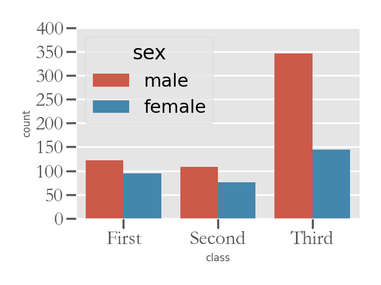
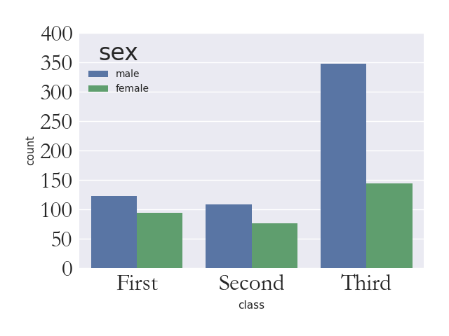
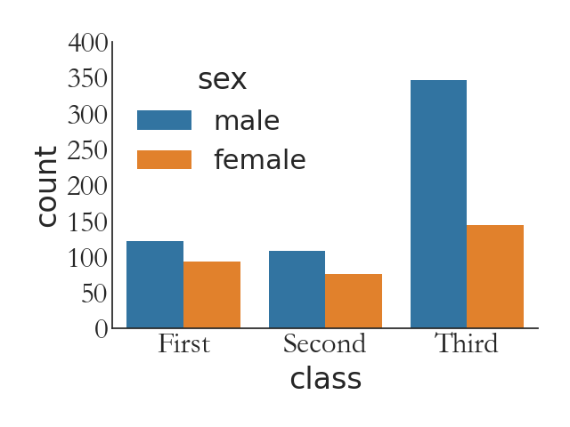
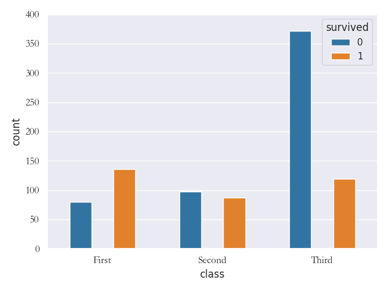

# 导入模块
```python
>>> import sys
>>> sys.path.append(r"D:\document\statistics\TidyStatsProject")
>>> from EasySeaborn import count
>>> import matplotlib.pyplot as plt
>>> from SoEasyData import GetSeabornData
>>> import numpy as np
>>> titanic = GetSeabornData("titanic")
>>> print(titanic)
```

## 测试df参数(绘制整个dataframe中字符变量的计数柱状图)
```python
>>> ax = count(titanic, savefilename="./image/count1.png", block=False)
>>> plt.pause(2)
>>> plt.close()
```


## 测试xvarname(竖直分类变量柱状图)
```python
>>> ax = count(titanic, xvarname="class", savefilename="./image/count2.png", block=False)
>>> plt.pause(2)
>>> plt.close()
```


## 测试yvarname参数(水平分类变量柱状图)
```python
>>> ax = count(titanic, xvarname="class", savefilename="./image/count3.png", block=False)
>>> plt.pause(2)
>>> plt.close()
```


## 测试groupby参数(分组分类变量柱状图)
```python
>>> ax = count(titanic, xvarname="class", groupby="survived", savefilename="./image/count4.png", block=False)
>>> plt.pause(2)
>>> plt.close()
```


## 测试一般标签参数
```python
>>> ax = count(titanic, xvarname="class", groupby="survived", xlabel="x", ylabel="y", title="count", xlabelsize=10, ylabelsize=16, titlesize=14, xticklabelsize=9, yticklabelsize=15, xticklabelrotation=30, yticklabelrotation=45, savefilename="./image/count5.png", block=False)
>>> plt.pause(2)
>>> plt.close()
```


## 测试colormap参数(绘图颜色)
```python
>>> ax = count(titanic, xvarname="class", groupby="survived", colormap="Accent", savefilename="./image/count6.png", block=False)
>>> plt.pause(2)
>>> plt.close()
```


## 测试fig_length和fig_width参数(图形大小)
```python
>>> ax = count(titanic, xvarname="class", groupby="survived", fig_length=6, fig_width=6, savefilename="./image/count7.png", block=False)
>>> plt.pause(2)
>>> plt.close()
```


## 测试layout参数(图形布局方式)
```python
>>> ax = count(titanic, xvarname="class", groupby="survived", layout="tight", savefilename="./image/count8.png", block=False)
>>> plt.pause(2)
>>> plt.close()
>>> ax = count(titanic, xvarname="class", groupby="survived", layout="compressed", savefilename="./image/count9.png", block=False)
>>> plt.pause(2)
>>> plt.close()
>>> ax = count(titanic, xvarname="class", groupby="survived", layout="constrained", savefilename="./image/count10.png", block=False)
>>> plt.pause(2)
>>> plt.close()
>>> ax = count(titanic, xvarname="class", groupby="survived", layout=None, savefilename="./image/count11.png", block=False)
>>> plt.pause(2)
>>> plt.close()
```


## 测试hue_order参数(分组排列顺序)
```python
>>> ax = count(titanic, xvarname="class", groupby="survived", hue_order=[1, 0], savefilename="./image/count12.png", block=False)
>>> plt.pause(2)
>>> plt.close()
```


## 测试order参数(柱子排列顺序)
```python
>>> ax = count(titanic, xvarname="class", groupby="survived", order=["First", "Third", "Second"], savefilename="./image/count13.png", block=False)
>>> plt.pause(2)
>>> plt.close()
```


## 测试fontfamily参数(字体)
```python
>>> ax = count(titanic, xvarname="class", groupby="survived", xlabel="X轴", ylabel="Y轴", xlabelsize=10, ylabelsize=16, titlesize=14, xticklabelsize=9, yticklabelsize=15, xticklabelrotation=30, yticklabelrotation=45, fontfamily="方正舒体", savefilename="./image/count14.png", block=False)
>>> plt.pause(2)
>>> plt.close()
>>> ax = count(titanic, xvarname="class", groupby="survived", xlabel="X轴", ylabel="Y轴", xlabelsize=10, ylabelsize=16, titlesize=14, xticklabelsize=9, yticklabelsize=15, xticklabelrotation=30, yticklabelrotation=45, fontfamily="方正姚体", savefilename="./image/count15.png", block=False)
>>> plt.pause(2)
>>> plt.close()
>>> ax = count(titanic, xvarname="class", groupby="survived", xlabel="X轴", ylabel="Y轴", xlabelsize=10, ylabelsize=16, titlesize=14, xticklabelsize=9, yticklabelsize=15, xticklabelrotation=30, yticklabelrotation=45, fontfamily="仿宋", savefilename="./image/count16.png", block=False)
>>> plt.pause(2)
>>> plt.close()
>>> ax = count(titanic, xvarname="class", groupby="survived", xlabel="X轴", ylabel="Y轴", xlabelsize=10, ylabelsize=16, titlesize=14, xticklabelsize=9, yticklabelsize=15, xticklabelrotation=30, yticklabelrotation=45, fontfamily="黑体", savefilename="./image/count17.png", block=False)
>>> plt.pause(2)
>>> plt.close()
>>> ax = count(titanic, xvarname="class", groupby="survived", xlabel="X轴", ylabel="Y轴", xlabelsize=10, ylabelsize=16, titlesize=14, xticklabelsize=9, yticklabelsize=15, xticklabelrotation=30, yticklabelrotation=45, fontfamily="华文彩云", savefilename="./image/count18.png", block=False)
>>> plt.pause(2)
>>> plt.close()
>>> ax = count(titanic, xvarname="class", groupby="survived", xlabel="X轴", ylabel="Y轴", xlabelsize=10, ylabelsize=16, titlesize=14, xticklabelsize=9, yticklabelsize=15, xticklabelrotation=30, yticklabelrotation=45, fontfamily="华文仿宋", savefilename="./image/count19.png", block=False)
>>> plt.pause(2)
>>> plt.close()
>>> ax = count(titanic, xvarname="class", groupby="survived", xlabel="X轴", ylabel="Y轴", xlabelsize=10, ylabelsize=16, titlesize=14, xticklabelsize=9, yticklabelsize=15, xticklabelrotation=30, yticklabelrotation=45, fontfamily="华文琥珀", savefilename="./image/count20.png", block=False)
>>> plt.pause(2)
>>> plt.close()
>>> ax = count(titanic, xvarname="class", groupby="survived", xlabel="X轴", ylabel="Y轴", xlabelsize=10, ylabelsize=16, titlesize=14, xticklabelsize=9, yticklabelsize=15, xticklabelrotation=30, yticklabelrotation=45, fontfamily="华文楷体", savefilename="./image/count21.png", block=False)
>>> plt.pause(2)
>>> plt.close()
>>> ax = count(titanic, xvarname="class", groupby="survived", xlabel="X轴", ylabel="Y轴", xlabelsize=10, ylabelsize=16, titlesize=14, xticklabelsize=9, yticklabelsize=15, xticklabelrotation=30, yticklabelrotation=45, fontfamily="华文隶书", savefilename="./image/count22.png", block=False)
>>> plt.pause(2)
>>> plt.close()
>>> ax = count(titanic, xvarname="class", groupby="survived", xlabel="X轴", ylabel="Y轴", xlabelsize=10, ylabelsize=16, titlesize=14, xticklabelsize=9, yticklabelsize=15, xticklabelrotation=30, yticklabelrotation=45, fontfamily="华文宋体", savefilename="./image/count23.png", block=False)
>>> plt.pause(2)
>>> plt.close()
>>> ax = count(titanic, xvarname="class", groupby="survived", xlabel="X轴", ylabel="Y轴", xlabelsize=10, ylabelsize=16, titlesize=14, xticklabelsize=9, yticklabelsize=15, xticklabelrotation=30, yticklabelrotation=45, fontfamily="华文细黑", savefilename="./image/count24.png", block=False)
>>> plt.pause(2)
>>> plt.close()
>>> ax = count(titanic, xvarname="class", groupby="survived", xlabel="X轴", ylabel="Y轴", xlabelsize=10, ylabelsize=16, titlesize=14, xticklabelsize=9, yticklabelsize=15, xticklabelrotation=30, yticklabelrotation=45, fontfamily="华文新魏", savefilename="./image/count25.png", block=False)
>>> plt.pause(2)
>>> plt.close()
>>> ax = count(titanic, xvarname="class", groupby="survived", xlabel="X轴", ylabel="Y轴", xlabelsize=10, ylabelsize=16, titlesize=14, xticklabelsize=9, yticklabelsize=15, xticklabelrotation=30, yticklabelrotation=45, fontfamily="华文行楷", savefilename="./image/count26.png", block=False)
>>> plt.pause(2)
>>> plt.close()
>>> ax = count(titanic, xvarname="class", groupby="survived", xlabel="X轴", ylabel="Y轴", xlabelsize=10, ylabelsize=16, titlesize=14, xticklabelsize=9, yticklabelsize=15, xticklabelrotation=30, yticklabelrotation=45, fontfamily="华文中宋", savefilename="./image/count27.png", block=False)
>>> plt.pause(2)
>>> plt.close()
>>> ax = count(titanic, xvarname="class", groupby="survived", xlabel="X轴", ylabel="Y轴", xlabelsize=10, ylabelsize=16, titlesize=14, xticklabelsize=9, yticklabelsize=15, xticklabelrotation=30, yticklabelrotation=45, fontfamily="楷体", savefilename="./image/count28.png", block=False)
>>> plt.pause(2)
>>> plt.close()
>>> ax = count(titanic, xvarname="class", groupby="survived", xlabel="X轴", ylabel="Y轴", xlabelsize=10, ylabelsize=16, titlesize=14, xticklabelsize=9, yticklabelsize=15, xticklabelrotation=30, yticklabelrotation=45, fontfamily="隶书", savefilename="./image/count29.png", block=False)
>>> plt.pause(2)
>>> plt.close()
>>> ax = count(titanic, xvarname="class", groupby="survived", xlabel="X轴", ylabel="Y轴", xlabelsize=10, ylabelsize=16, titlesize=14, xticklabelsize=9, yticklabelsize=15, xticklabelrotation=30, yticklabelrotation=45, fontfamily="宋体", savefilename="./image/count30.png", block=False)
>>> plt.pause(2)
>>> plt.close()
>>> ax = count(titanic, xvarname="class", groupby="survived", xlabel="X轴", ylabel="Y轴", xlabelsize=10, ylabelsize=16, titlesize=14, xticklabelsize=9, yticklabelsize=15, xticklabelrotation=30, yticklabelrotation=45, fontfamily="新宋体", savefilename="./image/count31.png", block=False)
>>> plt.pause(2)
>>> plt.close()
>>> ax = count(titanic, xvarname="class", groupby="survived", xlabel="X轴", ylabel="Y轴", xlabelsize=10, ylabelsize=16, titlesize=14, xticklabelsize=9, yticklabelsize=15, xticklabelrotation=30, yticklabelrotation=45, fontfamily="幼圆", savefilename="./image/count32.png", block=False)
>>> plt.pause(2)
>>> plt.close()
>>> ax = count(titanic, xvarname="class", groupby="survived", xlabel="class", ylabel="y轴", title="count Plot", xlabelsize=10, ylabelsize=16, titlesize=14, xticklabelsize=9, yticklabelsize=15, xticklabelrotation=30, yticklabelrotation=45, fontfamily="TimesNewRoman", savefilename="./image/count33.png", block=False)
>>> plt.pause(2)
>>> plt.close()
>>> ax = count(titanic, xvarname="class", groupby="survived", xlabel="class", ylabel="y轴", title="count Plot", xlabelsize=10, ylabelsize=16, titlesize=14, xticklabelsize=9, yticklabelsize=15, xticklabelrotation=30, yticklabelrotation=45, fontfamily="Arial", savefilename="./image/count34.png", block=False)
>>> plt.pause(2)
>>> plt.close()
```


## 测试isshowplot参数(是否显示图形)
```python
>>> ax = count(titanic, xvarname="class", groupby="survived", isshowplot=0, savefilename="./image/count35.png", block=False)
>>> plt.pause(2)
>>> plt.close()
>>> ax = count(titanic, xvarname="class", groupby="survived", isshowplot=1, savefilename="./image/count36.png", block=False)
>>> plt.pause(2)
>>> plt.close()
```


## 测试snsstyle参数(使用seaborn的风格)
```python
>>> ax = count(titanic, xvarname="class", groupby="sex", snsstyle="darkgrid", savefilename="./image/count37.png", block=False)
>>> plt.pause(2)
>>> plt.close()
>>> ax = count(titanic, xvarname="class", groupby="sex", snsstyle="whitegrid", savefilename="./image/count38.png", block=False)
>>> plt.pause(2)
>>> plt.close()
>>> ax = count(titanic, xvarname="class", groupby="sex", snsstyle="dark", savefilename="./image/count39.png", block=False)
>>> plt.pause(2)
>>> plt.close()
>>> ax = count(titanic, xvarname="class", groupby="sex", snsstyle="white", savefilename="./image/count40.png", block=False)
>>> plt.pause(2)
>>> plt.close()
>>> ax = count(titanic, xvarname="class", groupby="sex", snsstyle="ticks", savefilename="./image/count41.png", block=False)
>>> plt.pause(2)
>>> plt.close()
```


## 测试isremoveleftspine参数(移除左轴线，snsstyle为ticks或者white时才有用)
```python
>>> ax = count(titanic, xvarname="class", groupby="sex", snsstyle="white", removeleftspine=1, savefilename="./image/count42.png", block=False)
>>> plt.pause(2)
>>> plt.close()
>>> ax = count(titanic, xvarname="class", groupby="sex", snsstyle="ticks", removeleftspine=0, savefilename="./image/count43.png", block=False)
>>> plt.pause(2)
>>> plt.close()
```


## 测试isremoverightspine参数(移除右轴线，snsstyle为ticks或者white时才有用)
```python
>>> ax = count(titanic, xvarname="class", groupby="sex", snsstyle="white", removerightspine=1, savefilename="./image/count44.png", block=False)
>>> plt.pause(2)
>>> plt.close()
>>> ax = count(titanic, xvarname="class", groupby="sex", snsstyle="ticks", removerightspine=0, savefilename="./image/count45.png", block=False)
>>> plt.pause(2)
>>> plt.close()
```


## 测试isremovetopspine参数(移除上轴线，snsstyle为ticks或者white时才有用)
```python
>>> ax = count(titanic, xvarname="class", groupby="sex", snsstyle="white", removetopspine=1, savefilename="./image/count46.png", block=False)
>>> plt.pause(2)
>>> plt.close()
>>> ax = count(titanic, xvarname="class", groupby="sex", snsstyle="ticks", removetopspine=0, savefilename="./image/count47.png", block=False)
>>> plt.pause(2)
>>> plt.close()
```


## 测试isremovebottomspine参数(移除下轴线，snsstyle为ticks或者white时才有用)
```python
>>> ax = count(titanic, xvarname="class", groupby="sex", snsstyle="white", removebottomspine=1, savefilename="./image/count48.png", block=False)
>>> plt.pause(2)
>>> plt.close()
>>> ax = count(titanic, xvarname="class", groupby="sex", snsstyle="ticks", removebottomspine=0, savefilename="./image/count49.png", block=False)
>>> plt.pause(2)
>>> plt.close()
```


## 测试offset参数(图形与轴线距离)
```python
>>> ax = count(titanic, xvarname="class", groupby="sex", snsstyle="ticks", offset=3, savefilename="./image/count50.png", block=False)
>>> plt.pause(2)
>>> plt.close()
>>> ax = count(titanic, xvarname="class", groupby="sex", offset=3, savefilename="./image/count51.png", block=False)
>>> plt.pause(2)
>>> plt.close()
```


## 测试trim参数(设置R风格轴线)
```python
>>> ax = count(titanic, xvarname="class", groupby="sex", snsstyle="ticks", trim=1, savefilename="./image/count52.png", block=False)
>>> plt.pause(2)
>>> plt.close()
>>> ax = count(titanic, xvarname="class", groupby="sex", trim=1, savefilename="./image/count53.png", block=False)
>>> plt.pause(2)
>>> plt.close()
```


## 测试contextstyle参数(绘图风格)
```python
>>> ax = count(titanic, xvarname="class", groupby="sex", contextstyle="notebook", savefilename="./image/count54.png", block=False)
>>> plt.pause(2)
>>> plt.close()
>>> ax = count(titanic, xvarname="class", groupby="sex", contextstyle="paper", savefilename="./image/count55.png", block=False)
>>> plt.pause(2)
>>> plt.close()
>>> ax = count(titanic, xvarname="class", groupby="sex", contextstyle="talk", savefilename="./image/count56.png", block=False)
>>> plt.pause(2)
>>> plt.close()
>>> ax = count(titanic, xvarname="class", groupby="sex", contextstyle="poster", savefilename="./image/count57.png", block=False)
>>> plt.pause(2)
>>> plt.close()
```


## 测试matplotlibstyle参数(matplotlib支持的绘图风格)
```python
>>> ax = count(titanic, xvarname="class", groupby="sex", matplotlibstyle="Solarize_Light2", savefilename="./image/count58.png", block=False)
>>> plt.pause(2)
>>> plt.close()
>>> ax = count(titanic, xvarname="class", groupby="sex", matplotlibstyle="_classic_test_patch", savefilename="./image/count59.png", block=False)
>>> plt.pause(2)
>>> plt.close()
>>> ax = count(titanic, xvarname="class", groupby="sex", matplotlibstyle="_mpl-gallery", savefilename="./image/count60.png", block=False)
>>> plt.pause(2)
>>> plt.close()
>>> ax = count(titanic, xvarname="class", groupby="sex", matplotlibstyle="_mpl-gallery-nogrid", savefilename="./image/count61.png", block=False)
>>> plt.pause(2)
>>> plt.close()
>>> ax = count(titanic, xvarname="class", groupby="sex", matplotlibstyle="bmh", savefilename="./image/count62.png", block=False)
>>> plt.pause(2)
>>> plt.close()
>>> ax = count(titanic, xvarname="class", groupby="sex", matplotlibstyle="classic", savefilename="./image/count63.png", block=False)
>>> plt.pause(2)
>>> plt.close()
>>> ax = count(titanic, xvarname="class", groupby="sex", matplotlibstyle="dark_background", savefilename="./image/count64.png", block=False)
>>> plt.pause(2)
>>> plt.close()
>>> ax = count(titanic, xvarname="class", groupby="sex", matplotlibstyle="fast", savefilename="./image/count65.png", block=False)
>>> plt.pause(2)
>>> plt.close()
>>> ax = count(titanic, xvarname="class", groupby="sex", matplotlibstyle="fivethirtyeight", savefilename="./image/count66.png", block=False)
>>> plt.pause(2)
>>> plt.close()
>>> ax = count(titanic, xvarname="class", groupby="sex", matplotlibstyle="ggplot", savefilename="./image/count67.png", block=False)
>>> plt.pause(2)
>>> plt.close()
>>> ax = count(titanic, xvarname="class", groupby="sex", matplotlibstyle="grayscale", savefilename="./image/count68.png", block=False)
>>> plt.pause(2)
>>> plt.close()
>>> ax = count(titanic, xvarname="class", groupby="sex", matplotlibstyle="seaborn-v0_8", savefilename="./image/count69.png", block=False)
>>> plt.pause(2)
>>> plt.close()
>>> ax = count(titanic, xvarname="class", groupby="sex", matplotlibstyle="seaborn-v0_8-bright", savefilename="./image/count70.png", block=False)
>>> plt.pause(2)
>>> plt.close()
>>> ax = count(titanic, xvarname="class", groupby="sex", matplotlibstyle="seaborn-v0_8-colorblind", savefilename="./image/count71.png", block=False)
>>> plt.pause(2)
>>> plt.close()
>>> ax = count(titanic, xvarname="class", groupby="sex", matplotlibstyle="seaborn-v0_8-dark", savefilename="./image/count72.png", block=False)
>>> plt.pause(2)
>>> plt.close()
>>> ax = count(titanic, xvarname="class", groupby="sex", matplotlibstyle="seaborn-v0_8-dark-palette", savefilename="./image/count73.png", block=False)
>>> plt.pause(2)
>>> plt.close()
>>> ax = count(titanic, xvarname="class", groupby="sex", matplotlibstyle="seaborn-v0_8-darkgrid", savefilename="./image/count74.png", block=False)
>>> plt.pause(2)
>>> plt.close()
>>> ax = count(titanic, xvarname="class", groupby="sex", matplotlibstyle="seaborn-v0_8-deep", savefilename="./image/count75.png", block=False)
>>> plt.pause(2)
>>> plt.close()
>>> ax = count(titanic, xvarname="class", groupby="sex", matplotlibstyle="seaborn-v0_8-muted", savefilename="./image/count76.png", block=False)
>>> plt.pause(2)
>>> plt.close()
>>> ax = count(titanic, xvarname="class", groupby="sex", matplotlibstyle="seaborn-v0_8-notebook", savefilename="./image/count77.png", block=False)
>>> plt.pause(2)
>>> plt.close()
>>> ax = count(titanic, xvarname="class", groupby="sex", matplotlibstyle="seaborn-v0_8-paper", savefilename="./image/count78.png", block=False)
>>> plt.pause(2)
>>> plt.close()
>>> ax = count(titanic, xvarname="class", groupby="sex", matplotlibstyle="seaborn-v0_8-pastel", savefilename="./image/count79.png", block=False)
>>> plt.pause(2)
>>> plt.close()
>>> ax = count(titanic, xvarname="class", groupby="sex", matplotlibstyle="seaborn-v0_8-poster", savefilename="./image/count80.png", block=False)
>>> plt.pause(2)
>>> plt.close()
>>> ax = count(titanic, xvarname="class", groupby="sex", matplotlibstyle="seaborn-v0_8-talk", savefilename="./image/count81.png", block=False)
>>> plt.pause(2)
>>> plt.close()
>>> ax = count(titanic, xvarname="class", groupby="sex", matplotlibstyle="seaborn-v0_8-ticks", savefilename="./image/count82.png", block=False)
>>> plt.pause(2)
>>> plt.close()
>>> ax = count(titanic, xvarname="class", groupby="sex", matplotlibstyle="seaborn-v0_8-white", savefilename="./image/count83.png", block=False)
>>> plt.pause(2)
>>> plt.close()
>>> ax = count(titanic, xvarname="class", groupby="sex", matplotlibstyle="seaborn-v0_8-whitegrid", savefilename="./image/count84.png", block=False)
>>> plt.pause(2)
>>> plt.close()
>>> ax = count(titanic, xvarname="class", groupby="sex", matplotlibstyle="tableau-colorblind10", savefilename="./image/count85.png", block=False)
>>> plt.pause(2)
>>> plt.close()
```











## 测试countparamsdict参数中的stat参数(设置Y轴含义)
```python
>>> ax = count(titanic, xvarname="class", groupby="survived", countparamsdict={"stat": "count"}, savefilename="./image/count86.png", block=False)
>>> plt.pause(2)
>>> plt.close()
>>> ax = count(titanic, xvarname="class", groupby="survived", countparamsdict={"stat": "percent"}, savefilename="./image/count87.png", block=False)
>>> plt.pause(2)
>>> plt.close()
>>> ax = count(titanic, xvarname="class", groupby="survived", countparamsdict={"stat": "proportion"}, savefilename="./image/count88.png", block=False)
>>> plt.pause(2)
>>> plt.close()
>>> ax = count(titanic, xvarname="class", groupby="survived", countparamsdict={"stat": "probability"}, savefilename="./image/count89.png", block=False)
>>> plt.pause(2)
>>> plt.close()
```


## 测试countparamsdict参数中的color参数(改变柱子颜色)
```python
>>> ax = count(titanic, xvarname="class", countparamsdict={"color": "green"}, savefilename="./image/count90.png", block=False)
>>> plt.pause(2)
>>> plt.close()
```


## 测试countparamsdict参数中的saturation参数(设置饱和度)
```python
>>> ax = count(titanic, xvarname="class", groupby="sex", countparamsdict={"color": "green", "saturation": 0.4}, savefilename="./image/count91.png", block=False)
>>> plt.pause(2)
>>> plt.close()
```


## 测试countparamsdict参数中的isfill参数(不填充颜色)
```python
>>> ax = count(titanic, xvarname="class", countparamsdict={"isfill": 0}, savefilename="./image/count92.png", block=False)
>>> plt.pause(2)
>>> plt.close()
```


## 测试countparamsdict参数中的width参数(柱子宽度)
```python
>>> ax = count(titanic, xvarname="class", countparamsdict={"width": 0.4}, savefilename="./image/count93.png", block=False)
>>> plt.pause(2)
>>> plt.close()
```


## 测试countparamsdict参数中的dodge参数(分组排列方式)
```python
>>> ax = count(titanic, xvarname="class", groupby="survived", countparamsdict={"dodge": 0}, savefilename="./image/count94.png", block=False)
>>> plt.pause(2)
>>> plt.close()
>>> ax = count(titanic, xvarname="class", groupby="survived", countparamsdict={"dodge": 1}, savefilename="./image/count95.png", block=False)
>>> plt.pause(2)
>>> plt.close()
>>> ax = count(titanic, xvarname="class", groupby="survived", countparamsdict={"dodge": "auto"}, savefilename="./image/count96.png", block=False)
>>> plt.pause(2)
>>> plt.close()
```


## 测试countparamsdict参数中的gap参数(并排排列柱子之间的距离)
```python
>>> ax = count(titanic, xvarname="class", groupby="survived", countparamsdict={"dodge": 1, "gap": 0.5}, savefilename="./image/count97.png", block=False)
>>> plt.pause(2)
>>> plt.close()
```



## 测试countparamsdict参数中的legend参数(图例设置样式)
```python
>>> ax = count(titanic, xvarname="class", groupby="survived", countparamsdict=
{"dodge": 1, "legend": "auto"}, savefilename="./image/count98.png", block=False)
>>> plt.pause(2)
>>> plt.close()
>>> ax = count(titanic, xvarname="class", groupby="survived", countparamsdict={"dodge": 1, "legend": "brief"}, savefilename="./image/count99.png", block=False)
>>> plt.pause(2)
>>> plt.close()
>>> ax = count(titanic, xvarname="class", groupby="survived", countparamsdict={"dodge": 1, "legend": "full"}, savefilename="./image/count100.png", block=False)
>>> plt.pause(2)
>>> plt.close()
>>> ax = count(titanic, xvarname="class", groupby="survived", countparamsdict={"dodge": 1, "legend": False}, savefilename="./image/count101.png", block=False)
>>> plt.pause(2)
>>> plt.close()
```


