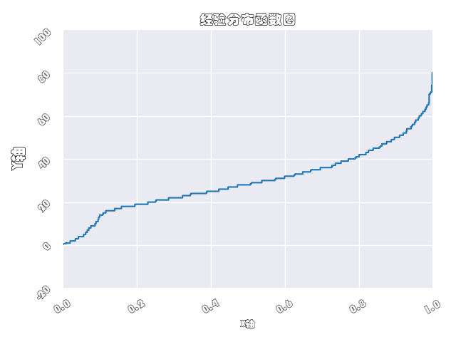
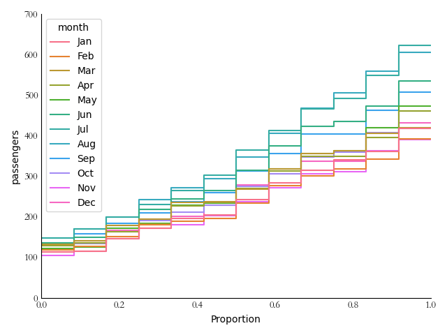

# 导入模块
```python
>>> import sys
>>> sys.path.append(r"D:\document\statistics\TidyStatsProject")
>>> from EasySeaborn import ecdf
>>> import matplotlib.pyplot as plt
>>> from SoEasyData import GetSeabornData
>>> import numpy as np
>>> titanic = GetSeabornData("titanic")
>>> flights = GetSeabornData("flights")
```

## 测试df参数(绘制整个dataframe中数值变量的估计量和误差值)
```python
>>> ax = ecdf(titanic, savefilename="./image/ecdf1.png",block=False)
>>> plt.pause(2)
>>> plt.close()
```


## 测试df参数(某列经验分布函数图)
```python
>>> ax = ecdf(titanic["age"], savefilename="./image/ecdf2.png", block=False)
>>> plt.pause(2)
>>> plt.close()
```


## 测试xvarname参数(给定x轴数值变量，单个变量绘制水平经验分布函数图)
```python
>>> ax = ecdf(titanic, xvarname="age", savefilename="./image/ecdf3.png", block=False)
>>> plt.pause(2)
>>> plt.close()
```


## 测试yvarname参数(给定y轴数值变量，单个变量绘制竖直经验分布函数图)
```python
>>> ax = ecdf(titanic, yvarname="age", savefilename="./image/ecdf4.png", block=False)
>>> plt.pause(2)
>>> plt.close()
```


## 测试groupby参数(给定XY变量下分组经验分布函数图，颜色类别区分)
```python
>>> ax = ecdf(titanic, yvarname="age", groupby="class", savefilename="./image/ecdf5.png", block=False)
>>> plt.pause(2)
>>> plt.close()
```


## 测试一般绘图的标签参数
```python
>>> ax = ecdf(titanic, yvarname="age", groupby="alive", xlabel="X轴", ylabel="Y轴", title="标题", xlabelsize=10, ylabelsize=16, titlesize=14, xticklabelsize=9, yticklabelsize=15, xticklabelrotation=30, yticklabelrotation=45, savefilename="./image/ecdf6.png", block=False)
>>> plt.pause(2)
>>> plt.close()
```


## 测试colormap参数(分组经验分布函数图指定颜色映射)
```python
>>> ax = ecdf(titanic, yvarname="age", groupby="alive", colormap="Set2", savefilename="./image/ecdf7.png", block=False)
>>> plt.pause(2)
>>> plt.close()
```


## 测试colormap参数(分组经验分布函数图指定颜色名称)
```python
>>> ax = ecdf(titanic, yvarname="age", groupby="alive", colormap=["red", "green"], savefilename="./image/ecdf8.png", block=False)
>>> plt.pause(2)
>>> plt.close()
```


## 测试fig_length和fig_width参数(图形大小)
```python
>>> ax = ecdf(titanic, yvarname="age", groupby="alive", fig_length=6, fig_width=8, savefilename="./image/ecdf9.png", block=False)
>>> plt.pause(2)
>>> plt.close()
```


## 测试layout参数(画布布局)
```python
>>> ax = ecdf(titanic, yvarname="age", groupby="alive", layout="constrained", savefilename="./image/ecdf10.png", block=False)
>>> plt.pause(2)
>>> plt.close()
>>> ax = ecdf(titanic, yvarname="age", groupby="alive", layout="compressed", savefilename="./image/ecdf11.png", block=False)
>>> plt.pause(2)
>>> plt.close()
>>> ax = ecdf(titanic, yvarname="age", groupby="alive", layout="tight", savefilename="./image/ecdf12.png", block=False)
>>> plt.pause(2)
>>> plt.close()
>>> ax = ecdf(titanic, yvarname="age", groupby="alive", layout=None, savefilename="./image/ecdf13.png", block=False)
>>> plt.pause(2)
>>> plt.close()
```


## 测试hue_order参数(分组变量中的顺序)
```python
>>> ax = ecdf(titanic, yvarname="age", groupby="alive", hue_order=["no", "yes"], savefilename="./image/ecdf14.png", block=False)
>>> plt.pause(2)
>>> plt.close()
>>> ax = ecdf(titanic, yvarname="age", groupby="alive", hue_order=["yes", "no"], savefilename="./image/ecdf15.png", block=False)
>>> plt.pause(2)
>>> plt.close()
```


## 测试fontfamily参数(指定字体样式)
```python
>>> ax = ecdf(titanic, yvarname="age", xlabel="X轴", ylabel="Y轴", title="经验分布函数图", xlabelsize=10, ylabelsize=16, titlesize=14, xticklabelsize=9, yticklabelsize=15, xticklabelrotation=30, yticklabelrotation=45, fontfamily="方正舒体", savefilename="./image/ecdf16.png", block=False)
>>> plt.pause(2)
>>> plt.close()
>>> ax = ecdf(titanic, yvarname="age", xlabel="X轴", ylabel="Y轴", title="经验分布函数图", xlabelsize=10, ylabelsize=16, titlesize=14, xticklabelsize=9, yticklabelsize=15, xticklabelrotation=30, yticklabelrotation=45, fontfamily="方正姚体", savefilename="./image/ecdf17.png", block=False)
>>> plt.pause(2)
>>> plt.close()
>>> ax = ecdf(titanic, yvarname="age", xlabel="X轴", ylabel="Y轴", title="经验分布函数图", xlabelsize=10, ylabelsize=16, titlesize=14, xticklabelsize=9, yticklabelsize=15, xticklabelrotation=30, yticklabelrotation=45, fontfamily="仿宋", savefilename="./image/ecdf18.png", block=False)
>>> plt.pause(2)
>>> plt.close()
>>> ax = ecdf(titanic, yvarname="age", xlabel="X轴", ylabel="Y轴", title="经验分布函数图", xlabelsize=10, ylabelsize=16, titlesize=14, xticklabelsize=9, yticklabelsize=15, xticklabelrotation=30, yticklabelrotation=45, fontfamily="黑体", savefilename="./image/ecdf19.png", block=False)
>>> plt.pause(2)
>>> plt.close()
>>> ax = ecdf(titanic, yvarname="age", xlabel="X轴", ylabel="Y轴", title="经验分布函数图", xlabelsize=10, ylabelsize=16, titlesize=14, xticklabelsize=9, yticklabelsize=15, xticklabelrotation=30, yticklabelrotation=45, fontfamily="华文彩云", savefilename="./image/ecdf20.png", block=False)
>>> plt.pause(2)
>>> plt.close()
>>> ax = ecdf(titanic, yvarname="age", xlabel="X轴", ylabel="Y轴", title="经验分布函数图", xlabelsize=10, ylabelsize=16, titlesize=14, xticklabelsize=9, yticklabelsize=15, xticklabelrotation=30, yticklabelrotation=45, fontfamily="华文仿宋", savefilename="./image/ecdf21.png", block=False)
>>> plt.pause(2)
>>> plt.close()
>>> ax = ecdf(titanic, yvarname="age", xlabel="X轴", ylabel="Y轴", title="经验分布函数图", xlabelsize=10, ylabelsize=16, titlesize=14, xticklabelsize=9, yticklabelsize=15, xticklabelrotation=30, yticklabelrotation=45, fontfamily="华文琥珀", savefilename="./image/ecdf22.png", block=False)
>>> plt.pause(2)
>>> plt.close()
>>> ax = ecdf(titanic, yvarname="age", xlabel="X轴", ylabel="Y轴", title="经验分布函数图", xlabelsize=10, ylabelsize=16, titlesize=14, xticklabelsize=9, yticklabelsize=15, xticklabelrotation=30, yticklabelrotation=45, fontfamily="华文楷体", savefilename="./image/ecdf23.png", block=False)
>>> plt.pause(2)
>>> plt.close()
>>> ax = ecdf(titanic, yvarname="age", xlabel="X轴", ylabel="Y轴", title="经验分布函数图", xlabelsize=10, ylabelsize=16, titlesize=14, xticklabelsize=9, yticklabelsize=15, xticklabelrotation=30, yticklabelrotation=45, fontfamily="华文隶书", savefilename="./image/ecdf24.png", block=False)
>>> plt.pause(2)
>>> plt.close()
>>> ax = ecdf(titanic, yvarname="age", xlabel="X轴", ylabel="Y轴", title="经验分布函数图", xlabelsize=10, ylabelsize=16, titlesize=14, xticklabelsize=9, yticklabelsize=15, xticklabelrotation=30, yticklabelrotation=45, fontfamily="华文宋体", savefilename="./image/ecdf25.png", block=False)
>>> plt.pause(2)
>>> plt.close()
>>> ax = ecdf(titanic, yvarname="age", xlabel="X轴", ylabel="Y轴", title="经验分布函数图", xlabelsize=10, ylabelsize=16, titlesize=14, xticklabelsize=9, yticklabelsize=15, xticklabelrotation=30, yticklabelrotation=45, fontfamily="华文细黑", savefilename="./image/ecdf26.png", block=False)
>>> plt.pause(2)
>>> plt.close()
>>> ax = ecdf(titanic, yvarname="age", xlabel="X轴", ylabel="Y轴", title="经验分布函数图", xlabelsize=10, ylabelsize=16, titlesize=14, xticklabelsize=9, yticklabelsize=15, xticklabelrotation=30, yticklabelrotation=45, fontfamily="华文新魏", savefilename="./image/ecdf27.png", block=False)
>>> plt.pause(2)
>>> plt.close()
>>> ax = ecdf(titanic, yvarname="age", xlabel="X轴", ylabel="Y轴", title="经验分布函数图", xlabelsize=10, ylabelsize=16, titlesize=14, xticklabelsize=9, yticklabelsize=15, xticklabelrotation=30, yticklabelrotation=45, fontfamily="华文行楷", savefilename="./image/ecdf28.png", block=False)
>>> plt.pause(2)
>>> plt.close()
>>> ax = ecdf(titanic, yvarname="age", xlabel="X轴", ylabel="Y轴", title="经验分布函数图", xlabelsize=10, ylabelsize=16, titlesize=14, xticklabelsize=9, yticklabelsize=15, xticklabelrotation=30, yticklabelrotation=45, fontfamily="华文中宋", savefilename="./image/ecdf29.png", block=False)
>>> plt.pause(2)
>>> plt.close()
>>> ax = ecdf(titanic, yvarname="age", xlabel="X轴", ylabel="Y轴", title="经验分布函数图", xlabelsize=10, ylabelsize=16, titlesize=14, xticklabelsize=9, yticklabelsize=15, xticklabelrotation=30, yticklabelrotation=45, fontfamily="楷体", savefilename="./image/ecdf30.png", block=False)
>>> plt.pause(2)
>>> plt.close()
>>> ax = ecdf(titanic, yvarname="age", xlabel="X轴", ylabel="Y轴", title="经验分布函数图", xlabelsize=10, ylabelsize=16, titlesize=14, xticklabelsize=9, yticklabelsize=15, xticklabelrotation=30, yticklabelrotation=45, fontfamily="隶书", savefilename="./image/ecdf31.png", block=False)
>>> plt.pause(2)
>>> plt.close()
>>> ax = ecdf(titanic, yvarname="age", xlabel="X轴", ylabel="Y轴", title="经验分布函数图", xlabelsize=10, ylabelsize=16, titlesize=14, xticklabelsize=9, yticklabelsize=15, xticklabelrotation=30, yticklabelrotation=45, fontfamily="宋体", savefilename="./image/ecdf32.png", block=False)
>>> plt.pause(2)
>>> plt.close()
>>> ax = ecdf(titanic, yvarname="age", xlabel="X轴", ylabel="Y轴", title="经验分布函数图", xlabelsize=10, ylabelsize=16, titlesize=14, xticklabelsize=9, yticklabelsize=15, xticklabelrotation=30, yticklabelrotation=45, fontfamily="新宋体", savefilename="./image/ecdf33.png", block=False)
>>> plt.pause(2)
>>> plt.close()
>>> ax = ecdf(titanic, yvarname="age", xlabel="X轴", ylabel="Y轴", title="经验分布函数图", xlabelsize=10, ylabelsize=16, titlesize=14, xticklabelsize=9, yticklabelsize=15, xticklabelrotation=30, yticklabelrotation=45, fontfamily="幼圆", savefilename="./image/ecdf34.png", block=False)
>>> plt.pause(2)
>>> plt.close()
>>> ax = ecdf(titanic, yvarname="age", xlabel="class", ylabel="age", title="ecdf Plot", xlabelsize=10, ylabelsize=16, titlesize=14, xticklabelsize=9, yticklabelsize=15, xticklabelrotation=30, yticklabelrotation=45, fontfamily="TimesNewRoman", savefilename="./image/ecdf35.png", block=False)
>>> plt.pause(2)
>>> plt.close()
>>> ax = ecdf(titanic, yvarname="age", xlabel="class", ylabel="age", title="ecdf Plot", xlabelsize=10, ylabelsize=16, titlesize=14, xticklabelsize=9, yticklabelsize=15, xticklabelrotation=30, yticklabelrotation=45, fontfamily="Arial", savefilename="./image/ecdf36.png", block=False)
>>> plt.pause(2)
>>> plt.close()
```





## 测试isshowplot参数(是否显示图形)
```python
>>> ax = ecdf(titanic, yvarname="age", isshowplot=1, savefilename="./image/ecdf37.png", block=False)
>>> plt.pause(2)
>>> plt.close()
>>> ax = ecdf(titanic, yvarname="age", isshowplot=0, savefilename="./image/ecdf38.png", block=False)
```


## 测试snsstyle参数(使用seaborn的风格)
```python
>>> ax = ecdf(titanic, yvarname="age", snsstyle="darkgrid", savefilename="./image/ecdf39.png", block=False)
>>> plt.pause(2)
>>> plt.close()
>>> ax = ecdf(titanic, yvarname="age", snsstyle="whitegrid", savefilename="./image/ecdf40.png", block=False)
>>> plt.pause(2)
>>> plt.close()
>>> ax = ecdf(titanic, yvarname="age", snsstyle="dark", savefilename="./image/ecdf41.png", block=False)
>>> plt.pause(2)
>>> plt.close()
>>> ax = ecdf(titanic, yvarname="age", snsstyle="white", savefilename="./image/ecdf42.png", block=False)
>>> plt.pause(2)
>>> plt.close()
>>> ax = ecdf(titanic, yvarname="age", snsstyle="ticks", savefilename="./image/ecdf43.png", block=False)
>>> plt.pause(2)
>>> plt.close()
```


## 测试isremoveleftspine参数(移除左轴线，snsstyle为ticks或者white时才有用)
```python
>>> ax = ecdf(titanic, yvarname="age", snsstyle="white", removeleftspine=1, savefilename="./image/ecdf44.png", block=False)
>>> plt.pause(2)
>>> plt.close()
>>> ax = ecdf(titanic, yvarname="age", snsstyle="ticks", removeleftspine=0, savefilename="./image/ecdf45.png", block=False)
>>> plt.pause(2)
>>> plt.close()
```


## 测试isremoverightspine参数(移除右轴线，snsstyle为ticks或者white时才有用)
```python
>>> ax = ecdf(titanic, yvarname="age", snsstyle="white", removerightspine=1, savefilename="./image/ecdf46.png", block=False)
>>> plt.pause(2)
>>> plt.close()
>>> ax = ecdf(titanic, yvarname="age", snsstyle="ticks", removerightspine=0, savefilename="./image/ecdf47.png", block=False)
>>> plt.pause(2)
>>> plt.close()
```


## 测试isremovetopspine参数(移除上轴线，snsstyle为ticks或者white时才有用)
```python
>>> ax = ecdf(titanic, yvarname="age", snsstyle="white", removetopspine=1, savefilename="./image/ecdf48.png", block=False)
>>> plt.pause(2)
>>> plt.close()
>>> ax = ecdf(titanic, yvarname="age", snsstyle="ticks", removetopspine=0, savefilename="./image/ecdf49.png", block=False)
>>> plt.pause(2)
>>> plt.close()
```


## 测试isremovebottomspine参数(移除下轴线，snsstyle为ticks或者white时才有用)
```python
>>> ax = ecdf(titanic, yvarname="age", snsstyle="white", removebottomspine=1, savefilename="./image/ecdf50.png", block=False)
>>> plt.pause(2)
>>> plt.close()
>>> ax = ecdf(titanic, yvarname="age", snsstyle="ticks", removebottomspine=0, savefilename="./image/ecdf51.png", block=False)
>>> plt.pause(2)
>>> plt.close()
```


## 测试offset参数(图形与轴线距离)
```python
>>> ax = ecdf(titanic, yvarname="age", snsstyle="ticks", offset=3, savefilename="./image/ecdf52.png", block=False)
>>> plt.pause(2)
>>> plt.close()
>>> ax = ecdf(titanic, yvarname="age", offset=3, savefilename="./image/ecdf53.png", block=False)
>>> plt.pause(2)
>>> plt.close()
```


## 测试trim参数(设置R风格轴线)
```python
>>> ax = ecdf(titanic, yvarname="age", snsstyle="ticks", trim=1, savefilename="./image/ecdf54.png", block=False)
>>> plt.pause(2)
>>> plt.close()
>>> ax = ecdf(titanic, yvarname="age", trim=1, savefilename="./image/ecdf55.png", block=False)
>>> plt.pause(2)
>>> plt.close()
```


## 测试contextstyle参数(绘图风格)
```python
>>> ax = ecdf(titanic, yvarname="age", contextstyle="notebook", savefilename="./image/ecdf56.png", block=False)
>>> plt.pause(2)
>>> plt.close()
>>> ax = ecdf(titanic, yvarname="age", contextstyle="paper", savefilename="./image/ecdf57.png", block=False)
>>> plt.pause(2)
>>> plt.close()
>>> ax = ecdf(titanic, yvarname="age", contextstyle="talk", savefilename="./image/ecdf58.png", block=False)
>>> plt.pause(2)
>>> plt.close()
>>> ax = ecdf(titanic, yvarname="age", contextstyle="poster", savefilename="./image/ecdf59.png", block=False)
>>> plt.pause(2)
>>> plt.close()
```


## 测试matplotlibstyle参数(matplotlib支持的绘图风格)
```python
>>> ax = ecdf(flights, groupby="month", yvarname="passengers", matplotlibstyle="Solarize_Light2", savefilename="./image/ecdf60.png", block=False)
>>> plt.pause(2)
>>> plt.close()
>>> ax = ecdf(flights, groupby="month", yvarname="passengers", matplotlibstyle="_classic_test_patch", savefilename="./image/ecdf61.png", block=False)
>>> plt.pause(2)
>>> plt.close()
>>> ax = ecdf(flights, groupby="month", yvarname="passengers", matplotlibstyle="_mpl-gallery", savefilename="./image/ecdf62.png", block=False)
>>> plt.pause(2)
>>> plt.close()
>>> ax = ecdf(flights, groupby="month", yvarname="passengers", matplotlibstyle="_mpl-gallery-nogrid", savefilename="./image/ecdf63.png", block=False)
>>> plt.pause(2)
>>> plt.close()
>>> ax = ecdf(flights, groupby="month", yvarname="passengers", matplotlibstyle="bmh", savefilename="./image/ecdf64.png", block=False)
>>> plt.pause(2)
>>> plt.close()
>>> ax = ecdf(flights, groupby="month", yvarname="passengers", matplotlibstyle="classic", savefilename="./image/ecdf65.png", block=False)
>>> plt.pause(2)
>>> plt.close()
>>> ax = ecdf(flights, groupby="month", yvarname="passengers", matplotlibstyle="dark_background", savefilename="./image/ecdf66.png", block=False)
>>> plt.pause(2)
>>> plt.close()
>>> ax = ecdf(flights, groupby="month", yvarname="passengers", matplotlibstyle="fast", savefilename="./image/ecdf67.png", block=False)
>>> plt.pause(2)
>>> plt.close()
>>> ax = ecdf(flights, groupby="month", yvarname="passengers", matplotlibstyle="fivethirtyeight", savefilename="./image/ecdf68.png", block=False)
>>> plt.pause(2)
>>> plt.close()
>>> ax = ecdf(flights, groupby="month", yvarname="passengers", matplotlibstyle="ggplot", savefilename="./image/ecdf69.png", block=False)
>>> plt.pause(2)
>>> plt.close()
>>> ax = ecdf(flights, groupby="month", yvarname="passengers", matplotlibstyle="grayscale", savefilename="./image/ecdf70.png", block=False)
>>> plt.pause(2)
>>> plt.close()
>>> ax = ecdf(flights, groupby="month", yvarname="passengers", matplotlibstyle="seaborn-v0_8", savefilename="./image/ecdf71.png", block=False)
>>> plt.pause(2)
>>> plt.close()
>>> ax = ecdf(flights, groupby="month", yvarname="passengers", matplotlibstyle="seaborn-v0_8-bright", savefilename="./image/ecdf72.png", block=False)
>>> plt.pause(2)
>>> plt.close()
>>> ax = ecdf(flights, groupby="month", yvarname="passengers", matplotlibstyle="seaborn-v0_8-colorblind", savefilename="./image/ecdf73.png", block=False)
>>> plt.pause(2)
>>> plt.close()
>>> ax = ecdf(flights, groupby="month", yvarname="passengers", matplotlibstyle="seaborn-v0_8-dark", savefilename="./image/ecdf74.png", block=False)
>>> plt.pause(2)
>>> plt.close()
>>> ax = ecdf(flights, groupby="month", yvarname="passengers", matplotlibstyle="seaborn-v0_8-dark-palette", savefilename="./image/ecdf75.png", block=False)
>>> plt.pause(2)
>>> plt.close()
>>> ax = ecdf(flights, groupby="month", yvarname="passengers", matplotlibstyle="seaborn-v0_8-darkgrid", savefilename="./image/ecdf76.png", block=False)
>>> plt.pause(2)
>>> plt.close()
>>> ax = ecdf(flights, groupby="month", yvarname="passengers", matplotlibstyle="seaborn-v0_8-deep", savefilename="./image/ecdf77.png", block=False)
>>> plt.pause(2)
>>> plt.close()
>>> ax = ecdf(flights, groupby="month", yvarname="passengers", matplotlibstyle="seaborn-v0_8-muted", savefilename="./image/ecdf78.png", block=False)
>>> plt.pause(2)
>>> plt.close()
>>> ax = ecdf(flights, groupby="month", yvarname="passengers", matplotlibstyle="seaborn-v0_8-notebook", savefilename="./image/ecdf79.png", block=False)
>>> plt.pause(2)
>>> plt.close()
>>> ax = ecdf(flights, groupby="month", yvarname="passengers", matplotlibstyle="seaborn-v0_8-paper", savefilename="./image/ecdf80.png", block=False)
>>> plt.pause(2)
>>> plt.close()
>>> ax = ecdf(flights, groupby="month", yvarname="passengers", matplotlibstyle="seaborn-v0_8-pastel", savefilename="./image/ecdf81.png", block=False)
>>> plt.pause(2)
>>> plt.close()
>>> ax = ecdf(flights, groupby="month", yvarname="passengers", matplotlibstyle="seaborn-v0_8-poster", savefilename="./image/ecdf82.png", block=False)
>>> plt.pause(2)
>>> plt.close()
>>> ax = ecdf(flights, groupby="month", yvarname="passengers", matplotlibstyle="seaborn-v0_8-talk", savefilename="./image/ecdf83.png", block=False)
>>> plt.pause(2)
>>> plt.close()
>>> ax = ecdf(flights, groupby="month", yvarname="passengers", matplotlibstyle="seaborn-v0_8-ticks", savefilename="./image/ecdf84.png", block=False)
>>> plt.pause(2)
>>> plt.close()
>>> ax = ecdf(flights, groupby="month", yvarname="passengers", matplotlibstyle="seaborn-v0_8-white", savefilename="./image/ecdf85.png", block=False)
>>> plt.pause(2)
>>> plt.close()
>>> ax = ecdf(flights, groupby="month", yvarname="passengers", matplotlibstyle="seaborn-v0_8-whitegrid", savefilename="./image/ecdf86.png", block=False)
>>> plt.pause(2)
>>> plt.close()
>>> ax = ecdf(flights, groupby="month", yvarname="passengers", matplotlibstyle="tableau-colorblind10", savefilename="./image/ecdf87.png", block=False)
>>> plt.pause(2)
>>> plt.close()
```





## 测试ecdfparamsdict参数中stat参数(经验分布函数图的Y轴含义)
```python
>>> ax = ecdf(titanic, groupby="survived", xvarname="age", ecdfparamsdict={"stat": "proportion"}, savefilename="./image/ecdf88.png", block=False)
>>> plt.pause(2)
>>> plt.close()
>>> ax = ecdf(titanic, groupby="survived", xvarname="age", ecdfparamsdict={"stat": "count"}, savefilename="./image/ecdf89.png", block=False)
>>> plt.pause(2)
>>> plt.close()
>>> ax = ecdf(titanic, groupby="survived", xvarname="age", ecdfparamsdict={"stat": "percent"}, savefilename="./image/ecdf90.png", block=False)
>>> plt.pause(2)
>>> plt.close()
```


## 测试ecdfparamsdict参数中iscomplementary参数(经验生存函数图)
```python
>>> ax = ecdf(titanic, groupby="survived", xvarname="age", ecdfparamsdict={"iscomplementary": 1}, savefilename="./image/ecdf91.png", block=False)
>>> plt.pause(2)
>>> plt.close()
>>> ax = ecdf(titanic, groupby="survived", xvarname="age", ecdfparamsdict={"iscomplementary": 0}, savefilename="./image/ecdf92.png", block=False)
>>> plt.pause(2)
>>> plt.close()
```


